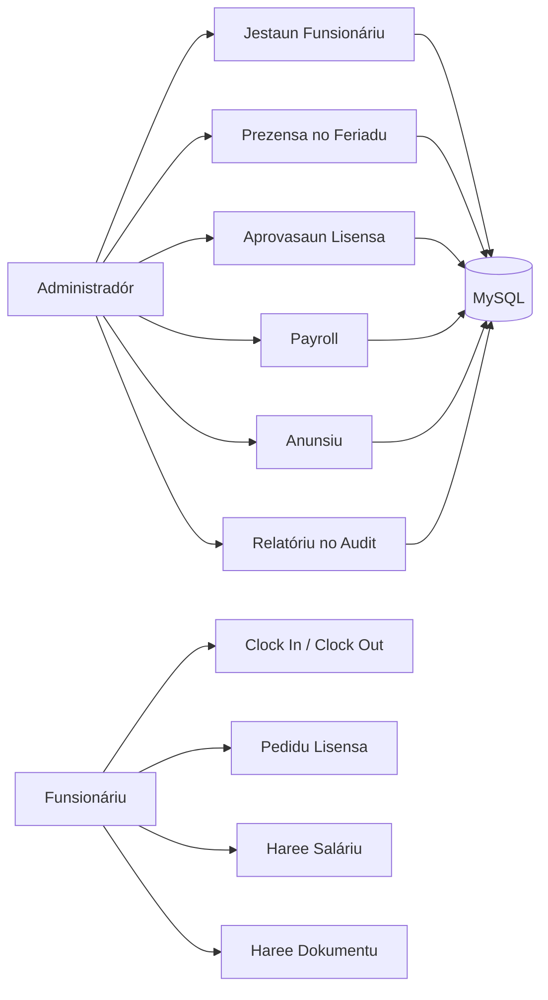

# SIMAUCATAR

**Sistema Jestaun Funsionáriu ba Postu Administrativu Maucatar.**

SIMAUCATAR mak aplikasaun HRIS lokál ho CodeIgniter 4 hodi ajuda administrasaun Maucatar jere funsionáriu, prezensa, lisensa, saláriu, dokumentu, anunsiu, sansaun, audit log, backup, no relatóriu iha sistema ida deit.


---

## Kona-ba Projetu

SIMAUCATAR dezenvolve hodi suporta prosesu rekursu umanu iha Postu Administrativu Maucatar. Sistema ida-ne'e fó fatin ba admin no funsionáriu hodi halo servisu loroloron ho dadus ne'ebé konsistente, fasil atu buka, no bele audit.

- Administradór bele jere funsionáriu, departamentu, pozisaun, kategoria, prezensa, lisensa, saláriu, dokumentu, anunsiu, sansaun, relatóriu, audit log, no backup.
- Funsionáriu bele haree painel rasik, halo clock in/out, haruka pedidu lisensa, haree dokumentu, haree resibu saláriu, no atualiza perfil.
- Sistema uza kontrolu asesu bazeia ba papel, CSRF, hash senha, audit trail, no route mutasaun ho method seguru.
- Label aplikasaun orienta ba lian Tetun atu hatán ba kontestu operasionál lokál.

## Teknolojia ne'ebé Uza

| Kategoria | Teknolojia | Funsaun |
| --- | --- | --- |
| Backend | CodeIgniter 4 | Routing, controller, filter, migration, no service aplikasaun |
| Linguajen | PHP 8.1+ | Lójika HRIS, validasaun, session, no prosesu server-side |
| Baze Dadus | MySQL / MariaDB | Rai dadus funsionáriu, prezensa, payroll, dokumentu, audit, no menu |
| Frontend | Bootstrap 5 | Layout painel, form, modal, tabela, no komponente responsivu |
| Gráfiku | ApexCharts | Vizualizasaun dadus iha painel admin no funsionáriu |
| Tabela | DataTables | Buka, ordena, no pagina dadus operasionál |
| Alert | SweetAlert2 / Notyf | Feedback visual ba asaun utilizadór |
| Dokumentu | DomPDF | Jera no exporta relatóriu PDF |
| Spreadsheet | PhpSpreadsheet | Importa no exporta dadus CSV/Excel |
| Testing | PHPUnit | Test automatizadu no guard ba regressaun |
| CLI | Spark Commands | Migration, server lokál, no command prezensa automátiku |

## Funsaun Prinsipál

### Painel Administradór

- Kartu resumu ba total funsionáriu, prezensa ohin, lisensa pendente, no anunsiu.
- Gráfiku tendénsia prezensa loron 15 ikus ba `Prezente`, `Tardi`, `Falta`, no `Lisensa`.
- Gráfiku kompozisaun departamentu.
- Lista anunsiu ikus no sansaun foun.

### Jestaun Funsionáriu

- CRUD dadus funsionáriu ho departamentu, pozisaun, kategoria, status, no akun login.
- Importa dadus funsionáriu husi CSV.
- Template import CSV hodi fó formatu dadus ne'ebé loos.
- Reset senha funsionáriu husi administradór.
- Upload foto perfil funsionáriu.

### Prezensa

- Clock in no clock out ba funsionáriu.
- Konfigurasaun oras prezensa, toleránsia, loron semana, no feriadu.
- Auto-mark absent liuhusi command `attendance:mark-absent`.
- Istória prezensa ba administradór no funsionáriu.

### Lisensa

- Pedidu lisensa online husi funsionáriu.
- Aprovasaun ka rejeisaun husi administradór ho komentáriu.
- Validasaun saldo lisensa no konfliktu ho prezensa.
- Rekalkulasaun leave balance bainhira estadu lisensa muda.

### Saláriu

- Prosesu saláriu ba kada funsionáriu, fulan, no tinan.
- Komponente subsidiu no deskontu.
- Integrasaun sansaun hodi kalkula potongan.
- Payroll period lock/unlock hodi proteje dadus periodu ne'ebé remata ona.
- Resibu saláriu ba funsionáriu ida-idak.

### Anunsiu

- Menu `Anunsiu` sai sentru ba komunikasaun no avizu sistema.
- Header bell hatudu anunsiu foun.
- Fitur notifikasaun separadu halo ona merge ba Anunsiu atu evita menu duplikadu.
- Anunsiu bele iha tempu remata atu la mosu tan iha header bainhira tempu liu ona.

### Dokumentu

- Administradór bele upload dokumentu funsionáriu.
- Kategoria dokumentu bele konfiguradu.
- Visibilidade dokumentu bele `admin_only` ka `employee_visible`.
- Funsionáriu haree deit dokumentu ne'ebé administradór loke ba nia.

### Audit, Backup, no Relatóriu

- Audit log ba asaun importante.
- Backup baze dadus husi UI Manutensaun.
- Restore SQL husi UI Manutensaun.
- Relatóriu funsionáriu, prezensa, lisensa, saláriu, no sansaun.
- Exporta relatóriu ba PDF no CSV.

## Fluxu Sistema



## Estrutura Projetu

```text
simaucatar/
|-- app/
|   |-- Commands/              # Command CLI hanesan attendance:mark-absent
|   |-- Config/                # Routes, filters, database, no konfigurasaun CI4
|   |-- Controllers/           # Auth, Administrador, Funsionariu, Relatoriu, Settings
|   |-- Database/
|   |   |-- Migrations/        # Skema no atualizasaun baze dadus
|   |   `-- Seeds/             # Dadus inisiál ba role, menu, no sistema
|   |-- Filters/               # Guard login no autorizasaun
|   |-- Models/                # Query aplikasaun no relatóriu
|   `-- Views/
|       |-- layouts/           # Layout prinsipál, sidebar, header, footer
|       |-- pages/             # Pajina administradór, funsionáriu, commons, settings
|       `-- widgets/           # Modal no form reutilizável
|-- public/
|   |-- assets/                # CSS, JS, icon, no bundle frontend
|   `-- uploads/               # Upload foto perfil no dokumentu
|-- tests/
|   `-- unit/                  # PHPUnit test
|-- writable/                  # Cache, log, session, backup
|-- composer.json
|-- README.md
`-- spark
```

## Oinsá Halai iha Lokál

### 1. Instala Dependénsia

```bash
composer install
```

### 2. Konfigura `.env`

Konfigurasaun prinsipál iha `.env`:

```ini
CI_ENVIRONMENT = development
app.baseURL = 'http://localhost:8080/'

database.default.hostname = 127.0.0.1
database.default.database = starterpanel
database.default.username = root
database.default.password = <senha-mysql-lokál>
database.default.DBDriver = MySQLi
```

### 3. Halai Migration

```bash
php spark migrate
```

Iha Windows, se `php` seidauk hetan iha PATH:

```powershell
C:\php\php.exe spark migrate
```

### 4. Hahu Server Lokál

```bash
php spark serve
```

Ka uza path PHP diretamente:

```powershell
C:\php\php.exe spark serve
```

Aplikasaun bele asesu iha:

```text
http://localhost:8080
```

## Login Lokál

```text
Username: admin
Password: admin123
```

Alternativu:

```text
Username: admin@gmail.com
Password: admin123
```

## Komandu Util

```bash
php spark serve
php spark migrate
php spark migrate:status
php spark attendance:mark-absent
php spark routes
vendor/bin/phpunit --no-coverage
```

Windows:

```powershell
C:\php\php.exe spark serve
C:\php\php.exe spark migrate
C:\php\php.exe vendor\phpunit\phpunit\phpunit --no-coverage
```

## Testing no Verifikasaun

```bash
php -l app/Controllers/Administrador.php
php -l app/Controllers/Funsionariu.php
node --check public/assets/js/app.js
vendor/bin/phpunit --no-coverage
```

Test automatizadu ne'ebé iha:

- Route mutasaun uza method seguru.
- Módulu audit, maintenance, feriadu, leave balance, documentu, no anunsiu konekta ona.
- Form POST hotu uza CSRF.
- Source aplikasaun la iha marker mojibake prinsipál.
- Módulu notifikasaun separadu la ativu tanba funsaun ne'e tama ona ba Anunsiu.
- Gráfiku painel uza ApexCharts lokál no iha dadus tendénsia.

## Etiketa

`codeigniter4` `php` `mysql` `bootstrap` `apexcharts` `hris` `payroll` `attendance` `leave-management` `document-management` `audit-log` `tetun` `timor-leste` `maucatar`

## Planu Oin

- Targeting Anunsiu tuir papel no departamentu.
- Aprovasaun lisensa ho nível barak.
- Shift multi-jadwál.
- 2FA ba administradór.
- Hardening ba implantasaun produsaun.
- Dashboard analytics ba tendénsia fulan no tinan.

## Lisensa

Projetu ida-ne'e uza lisensa [MIT](LICENSE).

---

**SIMAUCATAR** - HRIS lokál ne'ebé ordenadu, seguru, no prontu hodi suporta operasaun Postu Administrativu Maucatar.
