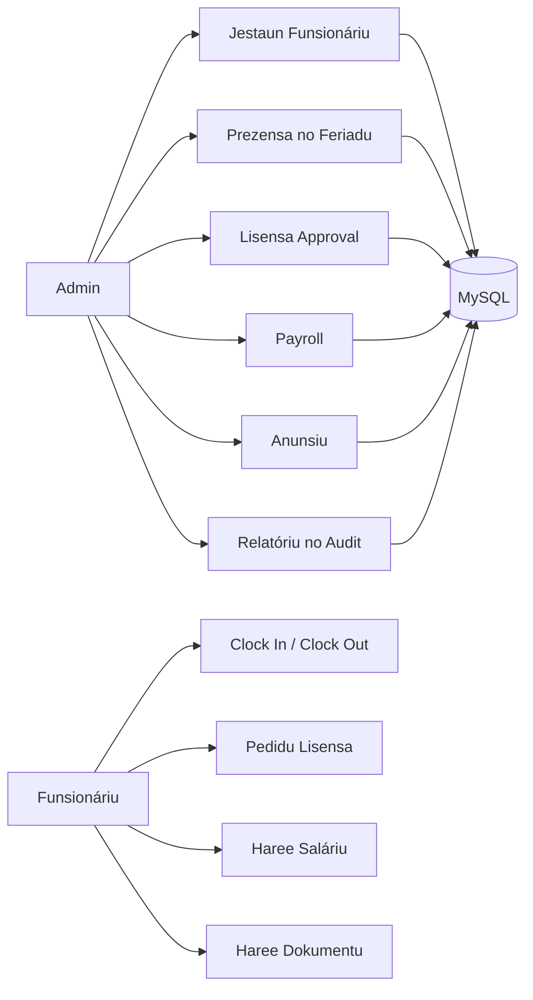

# SIMAUCATAR

**Sistema Jestaun Funsionáriu ba Postu Administrativu Maucatar.**
HRIS lokal berbasis CodeIgniter 4 untuk mengelola pegawai, presensi, lisensi/cuti, payroll, dokumen, anunsiu, sansaun, audit log, dan laporan operasional.


---

## Kona-ba Projetu

**SIMAUCATAR** membantu administrasaun Maucatar mengelola data sumber daya manusia dalam satu aplikasi lokal yang rapi dan bisa diaudit.

- Admin dapat mengelola pegawai, struktur organisasi, presensi, lisensi, payroll, dokumen, anunsiu, sansaun, laporan, backup, dan audit log.
- Funsionáriu dapat melihat dashboard pribadi, clock in/out, mengajukan lisensi, melihat dokumen, profil, dan slip salariu.
- Sistem memakai role based access control, CSRF, password hashing, audit trail, dan method route yang lebih aman untuk aksi mutasi.
- Tampilan aplikasi memakai label Tetun agar sesuai konteks operasional lokal.

## Teknolojia ne'ebe Uza

| Kategoria | Teknolojia | Funsaun |
| --- | --- | --- |
| Backend | CodeIgniter 4 | Routing, controller, filter, migration, dan service aplikasi |
| Linguajen | PHP 8.1+ | Logika HRIS, validasi, session, dan proses server-side |
| Database | MySQL / MariaDB | Penyimpanan pegawai, presensi, payroll, dokumen, audit, dan menu |
| Frontend | Bootstrap 5 | Layout dashboard, form, modal, tabel, dan komponen responsif |
| Chart | ApexCharts | Grafik dashboard admin dan funsionáriu |
| Tabel | DataTables | Pencarian, sorting, dan pagination tabel operasional |
| Alert | SweetAlert2 / Notyf | Feedback aksi pengguna |
| Dokumen | DomPDF | Export laporan PDF |
| Spreadsheet | PhpSpreadsheet | Export dan import data berbasis spreadsheet/CSV |
| Testing | PHPUnit | Unit test dan guard regression |
| CLI | Spark Commands | Migration, server lokal, dan command presensi otomatis |

## Funsaun Prinsipál

### Painel Administrador

- Kartu ringkasan total funsionáriu, prezensa ohin, lisensa pendente, dan anunsiu.
- Grafik tendénsia prezensa 15 hari terakhir untuk `Prezente`, `Tardi`, `Falta`, dan `Lisensa`.
- Grafik komposisi departamentu.
- Ringkasan anunsiu dan sansaun terbaru.

### Jestaun Funsionáriu

- CRUD data pegawai lengkap dengan departamentu, pozisaun, kategoria, status, dan akun login.
- Import CSV pegawai serta template import.
- Reset password pegawai oleh admin.
- Upload foto profil pegawai.

### Prezensa

- Clock in dan clock out untuk funsionáriu.
- Konfigurasi jam presensi, toleransi, weekend, dan hari libur.
- Auto-mark absent melalui command `attendance:mark-absent`.
- Riwayat presensi admin dan pegawai.

### Lisensa

- Pengajuan lisensi oleh funsionáriu.
- Approval/rejection oleh admin dengan komentar.
- Validasi saldo lisensi dan konflik presensi.
- Rekalkulasi leave balance setelah approval.

### Saláriu

- Proses payroll per pegawai, bulan, dan tahun.
- Komponen subsidiu dan deskontu.
- Integrasi sansaun untuk potongan.
- Payroll period lock/unlock agar periode yang selesai tidak berubah tanpa izin.
- Slip salariu untuk pegawai.

### Anunsiu

- Pusat pemberitahuan sistem memakai menu `Anunsiu`.
- Header bell menampilkan anunsiu terbaru.
- Fitur notifikasi terpisah sudah digabung ke Anunsiu agar tidak ada menu ganda.

### Dokumentu

- Admin dapat upload dokumen pegawai.
- Kategori dokumen bisa dikonfigurasi.
- Visibilitas dokumen bisa `admin_only` atau `employee_visible`.
- Pegawai dapat melihat dokumen yang memang dibuka untuk dirinya.

### Audit, Backup, dan Relatóriu

- Audit log untuk aksi penting.
- Backup database dari UI maintenance.
- Restore SQL dari UI maintenance.
- Laporan pegawai, presensi, lisensi, salariu, dan sansaun.
- Export PDF/CSV.

## Workflow Sistema



## Estrutura Projetu

```text
simaucatar/
|-- app/
|   |-- Commands/              # Command CLI seperti attendance:mark-absent
|   |-- Config/                # Routes, filters, database, dan konfigurasi CI4
|   |-- Controllers/           # Auth, Administrador, Funsionariu, Relatoriu, Settings
|   |-- Database/
|   |   |-- Migrations/        # Skema dan update database
|   |   `-- Seeds/             # Seeder role, menu, dan data awal
|   |-- Filters/               # Auth dan authorization filter
|   |-- Models/                # Query aplikasi dan laporan
|   `-- Views/
|       |-- layouts/           # Main layout, sidebar, header, footer
|       |-- pages/             # Halaman admin, funsionáriu, commons, settings
|       `-- widgets/           # Modal/form reusable
|-- public/
|   |-- assets/                # CSS, JS, icon, dan bundle frontend
|   `-- uploads/               # Upload profil dan dokumen
|-- tests/
|   `-- unit/                  # PHPUnit test
|-- writable/                  # Cache, log, session, backup
|-- composer.json
|-- README.md
`-- spark
```

## Oinsa Halai iha Lokal

### 1. Instala dependensia

```bash
composer install
```

### 2. Konfigura `.env`

Pastikan konfigurasi utama seperti ini:

```ini
CI_ENVIRONMENT = development
app.baseURL = 'http://localhost:8080/'

database.default.hostname = 127.0.0.1
database.default.database = starterpanel
database.default.username = root
database.default.password = <password-mysql-local>
database.default.DBDriver = MySQLi
```

### 3. Halai migration

```bash
php spark migrate
```

Jika `php` belum terbaca di terminal Windows:

```powershell
C:\php\php.exe spark migrate
```

### 4. Hahu server lokal

```bash
php spark serve
```

Atau:

```powershell
C:\php\php.exe spark serve
```

Aplikasi terbuka di:

```text
http://localhost:8080
```

## Login Lokal

```text
Username: admin
Password: admin123
```

Alternatif:

```text
Username: admin@gmail.com
Password: admin123
```

## Komandu Util

```bash
php spark serve
php spark migrate
php spark migrate:status
php spark attendance:mark-absent
php spark routes
vendor/bin/phpunit --no-coverage
```

Windows:

```powershell
C:\php\php.exe spark serve
C:\php\php.exe spark migrate
C:\php\php.exe vendor\phpunit\phpunit\phpunit --no-coverage
```

## Testing no Verifikasaun

```bash
php -l app/Controllers/Administrador.php
php -l app/Controllers/Funsionariu.php
node --check public/assets/js/app.js
vendor/bin/phpunit --no-coverage
```

Test yang sudah tersedia menjaga beberapa area penting:

- Route mutasi memakai method aman.
- Modul operasional seperti audit, maintenance, feriadu, leave balance, documentu, dan anunsiu terhubung.
- Form POST memiliki CSRF.
- Source aplikasi bebas marker mojibake utama.
- Modul notifikasi terpisah tidak aktif karena sudah digabung ke Anunsiu.

## Tags

`codeigniter4` `php` `mysql` `bootstrap` `apexcharts` `hris` `payroll` `attendance` `leave-management` `document-management` `audit-log` `tetun` `timor-leste` `maucatar`

## Roadmap

- Targeting Anunsiu per role/departamentu.
- Approval lisensa bertingkat.
- Shift multi-jadwal.
- 2FA untuk admin.
- Deployment production hardening.
- Dashboard analytics lebih lengkap untuk tren bulanan dan tahunan.

## Licensa

Projetu ida-ne'e uza lisensa [MIT](LICENSE).

---

**SIMAUCATAR** - HRIS lokal ne'ebe rapi, aman, no siap uza ba operasaun Postu Administrativu Maucatar.
