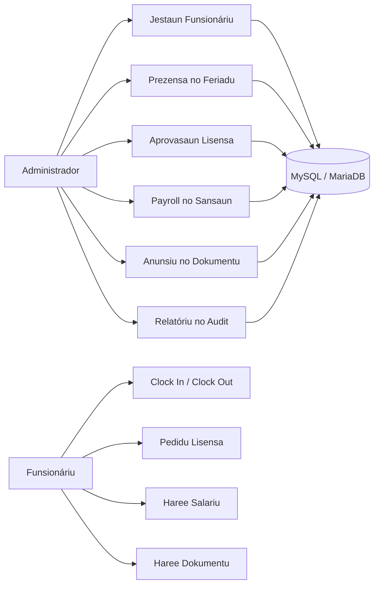

# SIMAUCATAR

**Sistema Jestaun Funsionáriu ba Postu Administrativu Maucatar.**

SIMAUCATAR mak aplikasaun HRIS lokál ne'ebé harii ho CodeIgniter 4 atu ajuda administrasaun Postu Administrativu Maucatar jere dadus funsionáriu, prezensa, lisensa, salariu, dokumentu, anunsiu, sansaun, audit log, backup, no relatóriu iha plataforma ida de'it.


---

## Kona-ba Projetu

Projetu ida-ne'e fó fatin ba administrador no funsionáriu atu halo prosesu rekursu umanu loroloron ho dadus ne'ebé ordenadu, fasil atu buka, no bele audit. Sistema fó prioridade ba kontestu lokál: label, menu, relatóriu, no fluxu servisu uza lian Tetun atu utilizadór bele komprende ho lalais.

SIMAUCATAR ajuda ekipa administrasaun atu:

- Rai no atualiza perfil funsionáriu.
- Jere departamentu, pozisaun, kategoria, no estrutura organizasaun.
- Kontrola prezensa, feriadu, lisensa, no saldo lisensa.
- Prosesa salariu, subsidiu, deskontu, no periodu payroll.
- Upload dokumentu no regula visibilidade dokumentu.
- Publika anunsiu, rejista sansaun, no haree audit log.
- Jera relatóriu no exporta dadus ba PDF ka CSV.

## Teknolojia ne'ebé Uza

| Kategoria | Teknolojia | Funsaun iha Sistema |
| --- | --- | --- |
| Framework | CodeIgniter 4 | Routing, controller, filter, migration, seeder, no service aplikasaun |
| Linguajen | PHP 8.1+ | Lójika server-side, validasaun, session, seguransa, no prosesu HRIS |
| Baze Dadus | MySQL / MariaDB | Rai dadus funsionáriu, prezensa, lisensa, salariu, dokumentu, audit, no menu |
| Frontend | Bootstrap 5 | Layout painel, form, modal, tabela, no komponente responsivu |
| Gráfiku | ApexCharts / Chart.js | Vizualizasaun dadus dashboard no tendénsia prezensa |
| Tabela | DataTables | Buka, ordena, filtra, no pagina dadus operasionál |
| Notifikasaun UI | Notyf / SweetAlert2 | Feedback ba asaun utilizadór |
| PDF | DomPDF | Exporta relatóriu ba PDF |
| Spreadsheet | PhpSpreadsheet | Importa no exporta dadus CSV/Excel |
| Testing | PHPUnit | Test automatizadu atu prevene regressaun |
| CLI | Spark Commands | Migration, server lokál, routes, no command prezensa automátiku |

## Funsaun Prinsipál

### Painel Administrador

- Kartu resumu ba total funsionáriu, prezensa ohin, lisensa pendente, no anunsiu.
- Gráfiku tendénsia prezensa ba `Prezente`, `Tardi`, `Falta`, no `Lisensa`.
- Kompozisaun funsionáriu tuir departamentu.
- Lista anunsiu ikus, sansaun foun, no dadus operasionál ne'ebé presiza atensaun.

### Jestaun Funsionáriu

- CRUD dadus funsionáriu ho departamentu, pozisaun, kategoria, status, no akun login.
- Importa dadus funsionáriu husi CSV/Excel.
- Download template import atu ajuda formatu dadus sai loos.
- Reset senha funsionáriu husi administrador.
- Upload no atualiza foto perfil.

### Prezensa

- Clock in no clock out ba funsionáriu.
- Konfigurasaun oras tama, oras sai, toleránsia, loron servisu, no feriadu.
- Command `attendance:mark-absent` atu marka falta ba funsionáriu ne'ebé la halo prezensa.
- Istória prezensa ba administrador no funsionáriu.

### Lisensa

- Funsionáriu bele haruka pedidu lisensa online.
- Administrador bele aprova ka rejeita pedidu ho komentáriu.
- Sistema halo validasaun saldo lisensa no konfliktu ho prezensa.
- Saldo lisensa bele jera no atualiza husi painel administrador.

### Salariu

- Prosesa salariu ba funsionáriu tuir fulan no tinan.
- Suporta salariu baziku, subsidiu, deskontu, no potongan sansaun.
- Periodu payroll bele `lock` no `unlock` atu proteje dadus ne'ebé remata ona.
- Funsionáriu bele haree resibu salariu rasik.

### Dokumentu

- Administrador bele upload dokumentu funsionáriu.
- Kategoria dokumentu bele jere husi painel administrador.
- Dokumentu bele tau hanesan `admin_only` ka `employee_visible`.
- Funsionáriu haree de'it dokumentu ne'ebé administrador fó asesu.

### Anunsiu, Sansaun, Audit, no Manutensaun

- Anunsiu sai sentru komunikasaun ba avizu sistema.
- Sansaun bele rejista, haree detalle, retira, ka jera husi absénsia.
- Audit log rai asaun importante iha sistema.
- Manutensaun suporta backup no restore baze dadus.

### Relatóriu

- Relatóriu funsionáriu.
- Relatóriu prezensa.
- Relatóriu lisensa.
- Relatóriu salariu.
- Relatóriu sansaun.
- Exporta relatóriu ba PDF no CSV.

## Fluxu Sistema



## Estrutura Projetu

```text
SIMAUCATAR-HRIS-Human-Resource-Information-System-CI4/
|-- app/
|   |-- Commands/              # Command CLI hanesan attendance:mark-absent
|   |-- Config/                # Routes, filters, database, no konfigurasaun CI4
|   |-- Controllers/           # Auth, Administrador, Funsionariu, Relatoriu, Settings
|   |-- Database/
|   |   |-- Migrations/        # Skema no alterasaun baze dadus
|   |   `-- Seeds/             # Dadus inisiál ba role, menu, no HRIS
|   |-- Filters/               # Authentication no authorization
|   |-- Helpers/               # Helper menu no user access
|   |-- Models/                # Query aplikasaun no relatóriu
|   `-- Views/
|       |-- layouts/           # Layout prinsipál, sidebar, header, footer
|       |-- pages/             # Pajina administrador, funsionáriu, commons, settings
|       `-- widgets/           # Modal no form reutilizável
|-- public/
|   |-- assets/                # CSS, JS, imagem, no bundle frontend
|   `-- uploads/               # Upload foto perfil, dokumentu, no lisensa
|-- tests/
|   `-- unit/                  # PHPUnit test ba HRIS
|-- writable/                  # Cache, log, session, upload, no backup
|-- composer.json
|-- README.md
`-- spark
```

## Rekerimentu

- PHP 8.1 ka liu.
- Composer.
- MySQL ka MariaDB.
- Ekstensaun PHP ne'ebé CodeIgniter 4 presiza, hanesan `intl`, `mbstring`, `json`, `mysqlnd`, no `curl`.
- Web browser modernu.

## Oinsá Halai iha Lokál

### 1. Clone Projetu

```bash
git clone https://github.com/herciomoreira3/SIMAUCATAR-HRIS-Human-Resource-Information-System-CI4.git
cd SIMAUCATAR-HRIS-Human-Resource-Information-System-CI4
```

### 2. Instala Dependénsia

```bash
composer install
```

### 3. Kria `.env`

Kopia file `env` ba `.env`:

```bash
cp env .env
```

Iha Windows PowerShell:

```powershell
Copy-Item env .env
```

### 4. Konfigura Ambiente

Atualiza `.env`:

```ini
CI_ENVIRONMENT = development
app.baseURL = 'http://localhost:8080/'

database.default.hostname = 127.0.0.1
database.default.database = starterpanel
database.default.username = root
database.default.password = <senha-mysql-lokál>
database.default.DBDriver = MySQLi
database.default.port = 3306
```

### 5. Kria Baze Dadus

Kria database:

```sql
CREATE DATABASE starterpanel CHARACTER SET utf8mb4 COLLATE utf8mb4_unicode_ci;
```

### 6. Halai Migration

```bash
php spark migrate
```

### 7. Halai Seeder

```bash
php spark db:seed Users
php spark db:seed HrisSeeder
```

### 8. Hahu Server Lokál

```bash
php spark serve
```

Aplikasaun bele asesu iha:

```text
http://localhost:8080
```

## Login Lokál

Login administrador HRIS:

```text
Username: admin
Password: admin123
```

Login developer husi seeder base:

```text
Username: developer@mail.io
Password: 123456
```

## Komandu Util

```bash
php spark serve
php spark migrate
php spark migrate:status
php spark db:seed Users
php spark db:seed HrisSeeder
php spark attendance:mark-absent
php spark routes
vendor/bin/phpunit --no-coverage
```

Iha Windows, se `php` la iha `PATH`, uza path PHP diretamente:

```powershell
C:\php\php.exe spark serve
C:\php\php.exe spark migrate
C:\php\php.exe spark attendance:mark-absent
C:\php\php.exe vendor\phpunit\phpunit\phpunit --no-coverage
```

## Testing no Verifikasaun

```bash
php -l app/Controllers/Administrador.php
php -l app/Controllers/Funsionariu.php
node --check public/assets/js/app.js
vendor/bin/phpunit --no-coverage
```

Test automatizadu iha repo ne'e haree ba:

- Konta loron lisensa inkluzivu.
- Route sensível uza HTTP method ne'ebé seguru.
- Módulu audit, maintenance, feriadu, leave balance, dokumentu, no anunsiu konekta ona.
- Form POST hotu uza CSRF.
- Notifikasaun separadu tama ona ba Anunsiu.
- Dashboard uza gráfiku lokál no dadus tendénsia.
- Source aplikasaun la iha marker mojibake prinsipál.

## Seguransa

- Password uza `password_hash`.
- Login no logout uza session.
- Filter `Authentication` no `Authorization` proteje pajina.
- Role based access control regula menu no asesu.
- Form POST uza CSRF.
- Route delete no mutasaun importante la uza GET.
- Audit log rai asaun importante.

## Etiketa

`codeigniter4` `php` `mysql` `mariadb` `bootstrap` `apexcharts` `chartjs` `datatables` `dompdf` `phpspreadsheet` `phpunit` `hris` `payroll` `attendance` `leave-management` `document-management` `audit-log` `tetun` `timor-leste` `maucatar`

## Planu Oin

- Target anunsiu tuir papel no departamentu.
- Aprovasaun lisensa ho nível barak.
- Shift servisu ho jadwál diferente.
- 2FA ba administrador.
- Hardening ba ambiente produsaun.
- Dashboard analytics ba fulan no tinan.

## Lisensa

Projetu ida-ne'e uza lisensa [MIT](LICENSE).

---

**SIMAUCATAR** - HRIS lokál, ordenadu, no seguru atu suporta servisu administrasaun iha Postu Administrativu Maucatar.
