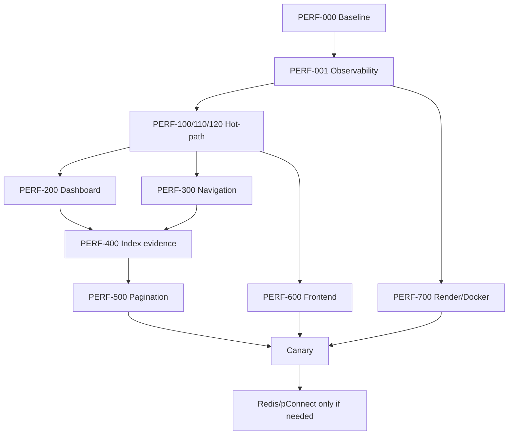

# Rencana Update dan Runbook Optimalisasi SI Maucatar

> Status: **rencana implementasi, belum dieksekusi**
>
> Sasaran runtime: CodeIgniter 4.6.1, PHP 8.3, Apache, Docker, Render.com, dan TiDB melalui MySQLi.
>
> Keluhan awal: dashboard dapat membutuhkan sekitar 19 detik dan perpindahan menu sekitar 4 detik.
>
> Tanggal audit repository: 27 Juli 2026.

---

## 0. Cara menggunakan dokumen ini

Dokumen ini adalah spesifikasi kerja, bukan perintah untuk mengubah semuanya sekaligus.

Aturan pelaksanaan:

1. Kerjakan task sesuai urutan dependensi.
2. Satu task harus menjadi satu commit kecil.
3. Jangan menggabungkan refactor, upgrade dependency, perubahan UI, dan optimasi SQL dalam satu commit.
4. Ambil baseline sebelum mengubah kode.
5. Setelah setiap task, jalankan acceptance check dan simpan buktinya.
6. Jangan lanjut jika stop condition task terpenuhi.
7. Jangan menjalankan candidate DDL sebelum memeriksa skema TiDB produksi.
8. Jangan memasukkan credential, DSN, cookie, token, isi query ber-PII, atau data pegawai ke log/commit.
9. Pertahankan jalur rollback sampai fase dinyatakan stabil.
10. Target performa di dokumen ini adalah acceptance target, bukan klaim bahwa produksi sudah mencapainya.

Urutan besar yang wajib dipertahankan:

```text
Baseline
  -> observability aman
  -> production hardening dan hot-path cleanup
  -> query dashboard
  -> navigation/RBAC
  -> indeks berbasis EXPLAIN
  -> pagination
  -> asset frontend
  -> Render/Docker
  -> cache/session/connection opsional
  -> canary dan penutupan
```

Setiap developer atau AI agent harus menutup task dengan format:

```text
Task:
Commit:
File berubah:
Baseline:
Hasil sesudah:
Test:
Risiko tersisa:
Rollback yang diuji:
Keputusan: PASS / FAIL / BLOCKED
```

---

## 1. Tujuan, non-tujuan, dan batas “tanpa mengorbankan apa pun”

### 1.1 Tujuan

- Mengurangi waktu tunggu dashboard dan menu secara material.
- Mengurangi jumlah round trip Render ke TiDB.
- Mengurangi data yang diambil tetapi tidak ditampilkan.
- Mengurangi JavaScript/CSS yang diproses pada halaman yang tidak memerlukannya.
- Memisahkan cold start, waktu aplikasi, waktu SQL, dan waktu browser.
- Membuat performa dapat diukur dan dijaga melalui test.
- Mempertahankan fungsi, keamanan, akurasi, dan data.

### 1.2 Non-tujuan

- Tidak mengurangi rentang grafik 15 hari.
- Tidak menghapus status kehadiran.
- Tidak menghapus audit log.
- Tidak menghilangkan pagination-independent export.
- Tidak menonaktifkan TLS atau verifikasi sertifikat untuk mengejar kecepatan.
- Tidak menonaktifkan CSRF, authentication, atau authorization.
- Tidak mengganti TiDB atau Render sebelum bukti menunjukkan kebutuhan.
- Tidak melakukan upgrade besar framework bersamaan dengan optimasi ini.
- Tidak mengubah aturan bisnis attendance, leave, payroll, sanction, atau report.
- Tidak menyembunyikan masalah menggunakan loading spinner tanpa mempercepat backend.

### 1.3 Invariant yang tidak boleh rusak

- Pengguna hanya melihat menu dan data sesuai role.
- Cache navigation tidak boleh tertukar antar-role.
- Perubahan permission harus efektif segera setelah mutasi berhasil.
- HTML terautentikasi tidak boleh dapat diputar ulang untuk pengguna lain.
- Hasil grafik baru harus identik dengan hasil lama untuk dataset yang sama.
- Tanggal yang tidak memiliki data tetap tampil sebagai nol.
- Filter report dan urutan data tetap benar.
- Export tetap memuat seluruh data yang cocok dengan filter, bukan hanya page aktif.
- Mutasi payroll/attendance/leave tetap transactional dan idempotent sesuai perilaku sekarang.
- Upload harus tetap dapat diakses setelah restart/redeploy.
- Kesalahan optimasi tidak boleh menghapus data.

---

## 2. Ringkasan diagnosis

Masalah utama bukan satu query yang sangat berat. Masalah utamanya adalah banyak query kecil dijalankan **secara serial** ke database jarak jauh.

Dashboard administrator menjalankan 15 hari × 4 status = 60 `COUNT` terpisah. Dashboard pegawai menjalankan empat total status dan 60 `COUNT` tren. Selain itu, setiap halaman terautentikasi mengambil user, kategori menu, seluruh pengumuman, kemudian view sidebar menjalankan query lagi per kategori dan per parent menu.

Pada koneksi lokal, pola ini dapat terlihat “cukup cepat”. Pada Render dan TiDB yang terpisah jaringan, setiap round trip menambah latency. Sebagai hipotesis:

```text
waktu minimum akibat round trip ~= jumlah query serial × RTT database
```

Contoh ilustratif, bukan pengukuran produksi:

```text
70 query serial × 150 ms RTT = 10,5 detik
70 query serial × 250 ms RTT = 17,5 detik
```

Angka ini menjelaskan mengapa keluhan 19 detik masuk akal, tetapi harus dibuktikan dengan telemetry.

Selain backend, semua halaman memuat dependency tabel/dialog dan bundle besar, walaupun dashboard tidak memerlukannya. Ini menambah waktu parse/execute browser setelah TTFB.

Ada tiga kelas latency yang harus dipisahkan:

1. **Cold platform start**: proses/container Render belum aktif.
2. **Warm server response**: PHP, framework, session, network database, dan query.
3. **Browser render**: download, parse, execute, layout, dan chart.

Jangan menyebut satu kelas sebagai penyebab kelas lain tanpa data.

---

## 3. Bukti repository yang sudah diverifikasi

| Area | Bukti | Dampak |
|---|---|---|
| Dashboard admin | `app/Controllers/Administrador.php:63-101` | 60 `COUNT` serial, query komposisi, dan beberapa result penuh |
| Dashboard pegawai | `app/Controllers/Funsionariu.php:20-60` | 64 `COUNT` serta query riwayat penuh yang hasilnya tidak dipakai view |
| Shared request | `app/Controllers/BaseController.php:56-78` | Service dan DB eager; user, kategori menu, pengumuman pada setiap request |
| Login GET | `BaseController.php:63` + `ApplicationModel.php:152-156` | Username kosong membuat `getUser()` mengambil seluruh user |
| Introspeksi hot path | `app/Models/ApplicationModel.php:111,408,437` | `getFieldNames`/`fieldExists` mengenai metadata database saat request |
| Menu N+1 | `app/Views/layouts/sidebar.php:11-59` | `getMenu` per kategori dan `getSubMenu` per parent |
| Helper menu | `app/Helpers/menu_helper.php:2-20` | Query database dipanggil dari view |
| Permission page | `app/Helpers/useraccess_helper.php:2-24` | Query per checkbox pada halaman role access |
| Announcement | `ApplicationModel.php:404-415` | Seluruh announcement aktif diambil; view dashboard hanya memakai 3/5 |
| Sanction preview | `Administrador.php:93` + admin dashboard `:169` | Seluruh sanction diambil; view hanya memakai 5 |
| Unused query | `Funsionariu.php:50` | `prezensa_fulan` tidak direferensikan view/test |
| Redirect chain | `sidebar.php:3`, `Auth.php:11-13`, `Home.php:7-14` | Brand `/` dapat memicu dua redirect sebelum role dashboard |
| List unbounded | `ApplicationModel.php:197-432`, controller admin/report | Banyak `getResultArray()` tanpa limit/pager |
| Runtime asset | `app/Views/layouts/main.php:15-35,53` | jQuery, DataTables, SweetAlert global; bundle besar |
| Bundle JS | `public/assets/js/app.js` | 2.962.777 byte; memuat ApexCharts, Chart.js, Moment, Feather |
| CSS | `public/assets/css/app.css` | 522.573 byte; Bootstrap CSS juga dimuat dari CDN |
| Optimize | `app/Config/Optimize.php:20-29` | Config cache dan locator cache `false` |
| Session | `app/Config/Session.php:24,60` | File session pada filesystem container |
| Cache | `app/Config/Cache.php:24,83-86` | File cache, tetapi belum dipakai untuk navigation |
| Filter | `app/Config/Filters.php:57-87` | PageCache/performance/toolbar required; global auth/RBAC |
| Database | `app/Config/Database.php:35-40,192-230` | Non-persistent; config dimutasi dari env dalam constructor |
| Container | `Dockerfile:1-58` | PHP Apache, OPcache extension ada, tuning produksi belum ada |
| Entrypoint | `docker-entrypoint.sh:15-79` | Default development, mencetak `.env`, migrate+seed setiap start |
| Rahasia | `docker-entrypoint.sh:47,56-57` | Encryption key ada di source dan `.env` dicetak ke log |
| Debug publik | `public/debug.php:1-69` | Endpoint publik menampilkan info koneksi/environment dan menghubungi DB |
| Health saat ini | `CronJob.php:257-273` | Membutuhkan token dan memanggil settings yang introspektif/berpotensi insert |
| Storage | controller upload + `public/uploads` | Render filesystem default bersifat ephemeral |
| Index awal | migration hardening `:299-306` | Hanya employee-date, employee-leave-dates, employee-sanction-status |
| Report sanction | `app/Models/RelatoriuModel.php:100-113` | `MONTH()`/`YEAR()` membuat filter tanggal tidak sargable |
| Test awal | PHPUnit lokal | 14 test, 59 assertion lulus; runner warning karena coverage driver tidak ada |

Catatan:

- Repository tidak memiliki `render.yaml`; konfigurasi dashboard Render adalah unknown.
- Skema dari migration, `starterpanel.sql`, dan produksi dapat berbeda.
- Data cardinality, tipe plan Render, tipe TiDB, dan region belum tersedia.
- Karena itu, candidate index tidak boleh dianggap sudah pasti benar.

---

## 4. Baseline dan worksheet produksi

### PERF-000 — Kumpulkan fakta lingkungan

**Tujuan**

Menentukan apakah latency berasal dari cold start, jaringan, query, PHP, atau browser.

**Owner**

Developer yang memiliki akses read-only ke Render dan TiDB Cloud.

**Data yang wajib diisi**

| Item | Nilai | Bukti |
|---|---|---|
| Render instance type | UNKNOWN | screenshot/export setting |
| Render region | UNKNOWN | service setting |
| TiDB plan: Starter/Essential/Dedicated | UNKNOWN | cluster overview |
| TiDB cloud provider dan region | UNKNOWN | cluster overview |
| Jarak region Render–TiDB | UNKNOWN | hasil pengukuran |
| Jumlah pegawai | UNKNOWN | safe aggregate |
| Jumlah attendance | UNKNOWN | safe aggregate |
| Jumlah leave | UNKNOWN | safe aggregate |
| Jumlah salary | UNKNOWN | safe aggregate |
| Jumlah announcement aktif | UNKNOWN | safe aggregate |
| Jumlah kategori/menu/submenu per role | UNKNOWN | safe aggregate |
| Peak concurrent user | UNKNOWN | Render metrics/log |
| Cold request duration | UNKNOWN | timestamped trace |
| Warm request p50/p95 | UNKNOWN | minimal 30 sample |
| Warm dashboard query count | UNKNOWN | telemetry |
| DB duration vs app duration | UNKNOWN | telemetry |
| Browser transfer/parse/LCP | UNKNOWN | DevTools/Lighthouse |

**Safe SQL**

Jalankan dengan user read-only dan jangan menyalin row PII:

```sql
SELECT VERSION() AS database_version;

SELECT
  (SELECT COUNT(*) FROM funsionariu) AS employee_count,
  (SELECT COUNT(*) FROM prezensa) AS attendance_count,
  (SELECT COUNT(*) FROM lisensa) AS leave_count,
  (SELECT COUNT(*) FROM salariu) AS salary_count,
  (SELECT COUNT(*) FROM avizu) AS announcement_count,
  (SELECT COUNT(*) FROM user_access) AS access_count;
```

**Pengukuran HTTP Linux/macOS**

```bash
curl -sS -o /dev/null \
  -w 'code=%{http_code} dns=%{time_namelookup} connect=%{time_connect} tls=%{time_appconnect} ttfb=%{time_starttransfer} total=%{time_total}\n' \
  'https://HOST/health/live'
```

Untuk route authenticated, gunakan akun test dan cookie sementara. Jangan commit cookie:

```bash
curl -sS -b /tmp/simaucatar-cookie.txt -o /dev/null \
  -w 'code=%{http_code} ttfb=%{time_starttransfer} total=%{time_total}\n' \
  'https://HOST/administrador/dashboard'
```

**Pengukuran PowerShell**

```powershell
$uri = 'https://HOST/health/live'
1..30 | ForEach-Object {
    $sw = [System.Diagnostics.Stopwatch]::StartNew()
    $response = Invoke-WebRequest -Uri $uri -UseBasicParsing
    $sw.Stop()
    [pscustomobject]@{
        sample = $_
        status = $response.StatusCode
        total_ms = $sw.ElapsedMilliseconds
    }
}
```

**Cara membedakan cold/warm**

1. Catat waktu idle terakhir.
2. Ambil satu request setelah idle panjang dan tandai `cold_candidate`.
3. Setelah response pertama selesai, kirim 30 request dengan jeda 1–2 detik.
4. Jangan campurkan sample pertama ke statistik warm.
5. Cocokkan timestamp dengan event restart/deploy pada Render.
6. Cocokkan dengan TiDB metrics/Statement Analysis.

**Acceptance**

- Semua kolom worksheet terisi atau memiliki alasan akses yang jelas.
- Minimal 30 warm sample untuk route dashboard admin, dashboard employee, dan satu menu biasa.
- Minimal satu cold candidate yang bisa dicocokkan ke log Render.
- Tidak ada credential/PII di artefak.

**Stop condition**

- Hentikan jika hanya tersedia database write user tanpa cara menjamin query read-only.
- Hentikan jika pengujian membebani produksi; pindah ke preview service/salinan data.

---

## 5. Target SLO dan performance budget

Target berikut diterapkan pada sample warm setelah fase P0 selesai.

| Metrik | Baseline | Target acceptance |
|---|---:|---:|
| Menu biasa p50 TTFB | ukur | ≤ 500 ms |
| Menu biasa p95 TTFB | ukur | ≤ 1.200 ms |
| Dashboard admin p50 TTFB | ukur | ≤ 1.200 ms |
| Dashboard admin p95 TTFB | ukur | ≤ 2.500 ms |
| Dashboard employee p95 TTFB | ukur | ≤ 2.000 ms |
| Error rate HTTP 5xx | ukur | tidak lebih buruk; target < 0,5% |
| Dashboard admin SQL count | ukur | ≤ 10 |
| Dashboard employee SQL count | ukur | ≤ 10 |
| Menu biasa SQL count | ukur | ≤ 5 setelah cache warm |
| Login GET SQL count | ukur | 0 jika tidak membutuhkan konten DB |
| Introspeksi skema pada hot route | ukur | 0 |
| Query DB terlama route biasa | ukur | < 300 ms atau punya analisis |
| LCP dashboard warm | ukur | ≤ 2,5 detik pada profil test yang disepakati |
| Initial JS dashboard gzip | ukur | ≤ 350 KB atau turun ≥ 50% |
| Initial CSS dashboard gzip | ukur | turun ≥ 30% tanpa visual regression |
| Cache/RBAC leakage test | N/A | 0 kegagalan |
| Golden chart parity | N/A | 100% sama |

SLO cold start:

- Ukur terpisah dari warm SLO.
- Pada Render Free, platform dapat spin down; ini tidak dapat diselesaikan sepenuhnya dengan kode.
- Target aplikasi setelah container mulai: endpoint live tersedia ≤ 10 detik.
- Seeder tidak boleh menambah cold start produksi.
- Migration tidak boleh berjalan pada setiap wake/restart.
- Jika cold response konsisten wajib cepat, keputusan paid instance adalah keputusan produk/biaya, bukan trik kode.

---

## 6. Prioritas dan dependensi

### P0 — lakukan lebih dahulu

- PERF-001 telemetry request/query.
- PERF-100 production dan secret hardening.
- PERF-110 hapus introspeksi skema dari hot path.
- PERF-120 perbaiki BaseController/login/redirect.
- PERF-200 collapse query dashboard.
- PERF-300 navigation tree dan invalidation.
- PERF-400 indeks dashboard/RBAC yang terbukti oleh EXPLAIN.

### P1 — setelah P0 stabil

- PERF-500 pagination/server-side tables.
- PERF-600 asset split, defer, self-host, compression.
- PERF-700 Docker/OPcache/health/deploy.
- PERF-710 durable upload storage.

### P2 — hanya jika data menunjukkan perlu

- PERF-800 Redis bersama.
- PERF-810 persistent connection experiment.
- PERF-820 horizontal scaling.
- PERF-830 background/batch refactor.
- Upgrade framework/dependency terpisah.



---

## 7. Fase 0 — observability aman

### PERF-001 — Request dan query telemetry

**File yang dibuat**

- `app/Libraries/PerformanceContext.php`
- `app/Filters/PerformanceTelemetry.php`
- `tests/unit/PerformanceContextTest.php`
- `tests/integration/PerformanceTelemetryTest.php`

**File yang diubah**

- `app/Config/Events.php`
- `app/Config/Filters.php`
- `env`

**Kontrak**

- Telemetry aktif melalui `PERF_TELEMETRY_ENABLED=true`.
- Satu request memiliki request ID.
- Catat total request ms, DB ms, query count, memory peak, route, method, status.
- Jangan catat raw SQL, bind value, request body, cookie, token, username, NID, atau nama pegawai.
- Hanya header generik yang boleh terlihat client:

```text
Server-Timing: app;dur=..., db;dur=...;desc="database", sql;desc="count"
X-Request-ID: UUID
```

**Pseudocode event**

```php
if (filter_var(env('PERF_TELEMETRY_ENABLED', false), FILTER_VALIDATE_BOOL)) {
    Events::on('DBQuery', static function (\CodeIgniter\Database\Query $query): void {
        PerformanceContext::recordQueryDuration((float) $query->getDuration(6));
    });
}
```

Jangan memakai collector Debug Toolbar di produksi. Buat collector minimal sendiri.

**Format log**

```json
{
  "event": "request_performance",
  "request_id": "uuid",
  "route": "administrador/dashboard",
  "method": "GET",
  "status": 200,
  "duration_ms": 842.1,
  "db_duration_ms": 391.2,
  "query_count": 7,
  "memory_peak_mb": 19.4,
  "cache": "nav_hit"
}
```

**Acceptance**

- Header dan log muncul ketika flag aktif.
- Flag mati memberi overhead yang tidak terukur secara material.
- Query gagal tetap menghitung durasi tanpa merekam value.
- Request ID unik dan tidak berasal dari input tanpa validasi.
- Test memastikan string SQL/credential tidak ada di log.

**Rollback**

- Matikan flag.
- Lepas alias filter jika filter menyebabkan error.

**Stop condition**

- Jangan deploy jika telemetry mencetak raw query yang mengandung bind value atau PII.

### PERF-002 — Baseline test artifact

**File yang dibuat**

- `docs/performance/baseline.md`
- `tests/performance/README.md`
- `tests/performance/http-smoke.ps1`
- `tests/performance/http-smoke.sh`

Isi `baseline.md` dengan:

- commit SHA;
- waktu dan timezone;
- Render/TiDB topology;
- cold/warm sample;
- query count;
- p50/p95;
- DevTools HAR yang sudah disanitasi;
- screenshot TiDB execution plan tanpa row data.

Acceptance: developer lain dapat mengulang pengukuran menggunakan perintah yang sama.

---

## 8. Fase 1 — quick-safe production dan hot path

### PERF-100 — Production environment, secret, dan startup

**File**

- `docker-entrypoint.sh`
- `Dockerfile`
- `.dockerignore`
- `app/Config/Database.php`
- Render environment/settings

**Langkah**

1. Ubah default `CI_ENVIRONMENT` menjadi `production`.
2. Lebih aman: fail startup jika environment production wajib tetapi tidak diset.
3. Hapus `cat /var/www/html/.env`.
4. Jangan mencetak DB host/user/password/encryption key.
5. Hapus encryption key hardcoded dari entrypoint.
6. Ambil encryption key dari secret environment.
7. Gunakan `umask 077` sebelum membuat `.env`.
8. Jangan menjalankan `HrisSeeder` pada startup produksi.
9. Pindahkan migration ke one-shot deploy step.
10. Hapus `public/debug.php` dari public image.
11. Tambahkan `public/debug.php`, `scratch/`, `composer.phar`, docs internal, test logs, dan source map yang tidak diperlukan ke `.dockerignore`.
12. Jangan menghapus file sumber dari repository hanya demi image; batasi melalui `.dockerignore`/multi-stage copy.

Entrypoint saat ini memakai `set -e`, sehingga pola:

```bash
php spark migrate
MIGRATE_STATUS=$?
```

tidak benar-benar menangani failure karena shell dapat keluar sebelum status dibaca.

Jalur deploy:

| Kondisi | Migration strategy |
|---|---|
| Render paid dengan pre-deploy | `php spark migrate --no-interaction` di pre-deploy |
| Render Free | CI job/manual release step bercredential terproteksi; web boot tidak seed |
| Belum ada release job | Flag eksplisit satu-kali, default false; catat sebagai sementara |

Jangan menjalankan migration pada Docker build karena runtime DB/secret tidak tersedia dan image harus reproducible.

**Secret response**

Karena `.env` sebelumnya dicetak:

1. Hentikan logging segera.
2. Batasi akses log.
3. Rotasi DB password setelah memastikan aplikasi baru siap.
4. Audit pemakaian encryption service sebelum rotasi encryption key.
5. Jangan merotasi key yang mengenkripsi data tanpa migration/decryption plan.

**Acceptance**

- Log startup tidak mengandung nilai secret.
- Production boot tidak menjalankan seeder.
- Migration failure membuat release gagal sebelum traffic berpindah.
- `/debug.php` mengembalikan 404.
- Production error page tidak menampilkan stack trace.
- Aplikasi bisa rollback ke **previous sanitized image** yang memakai secret aktif dari environment.

**Rollback**

- Sebelum rotasi credential, build dan verifikasi satu sanitized rollback image dari release stabil yang sama, tetapi tanpa hardcoded key, `cat .env`, dan `public/debug.php`.
- Tandai seluruh image sebelum sanitized baseline sebagai `DO_NOT_ROLLBACK`.
- Rollback hanya ke sanitized image; jangan pernah kembali ke build yang mencetak `.env` atau mengandung key lama.
- Sanitized image harus membaca credential aktif dari Render environment, bukan credential yang dibake ke image.
- Setelah rotasi, uji sanitized image dengan credential baru sebelum menjadikannya rollback target.
- Batasi/expire akses log lama dan catat deploy/log mana yang pernah memuat rahasia.
- DB migration harus additive/reversible atau memiliki forward-fix.

### PERF-110 — Hilangkan introspeksi skema dari hot path

**Masalah**

`getFieldNames`, `fieldExists`, dan `tableExists` dapat mengakses metadata TiDB. Ini tidak boleh dilakukan per request untuk skema yang sudah dikelola migration.

**File**

- `app/Models/ApplicationModel.php`
- `app/Controllers/Auth.php`
- `app/Controllers/BaseController.php`
- `app/Controllers/Funsionariu.php`
- `app/Controllers/Administrador.php`
- migration schema prerequisite baru
- test schema contract

**Langkah**

1. Buat command/readiness check yang memverifikasi kolom wajib:
   - `users.email`, `status`, `failed_login_count`, `locked_until`, `last_login_at`;
   - `avizu.data_remata`;
   - seluruh kolom `attendance_settings`;
   - `audit_logs`.
2. Jalankan prerequisite pada release, bukan request.
3. Setelah produksi memenuhi prerequisite, gunakan daftar field statis.
4. Pertahankan fallback `users`/`utilizador` jika masih dibutuhkan, tetapi jangan melakukan schema discovery.
5. Jika legacy account harus dipertahankan, buat golden login test untuk keduanya.
6. `getAttendanceSettings()` tidak boleh membuat row saat GET biasa. Seed/default row harus dibuat migration/seed one-shot.
7. `logAudit()` tidak boleh diam-diam melewati audit karena `tableExists`; release harus gagal bila tabel wajib tidak ada.

**Larangan**

- Jangan menghapus legacy login hanya untuk mengurangi satu query tanpa keputusan bisnis.
- Jangan menangkap semua exception lalu menganggap schema lama.
- Jangan cache hasil authorization tanpa invalidation.

**Acceptance**

- Telemetry menunjukkan nol query metadata pada hot route.
- Login modern dan legacy yang memang didukung tetap lulus.
- Read-only GET tidak melakukan INSERT.
- Missing required schema membuat readiness gagal, bukan merusak request acak.

**Rollback**

- Feature flag repository lama untuk satu release.
- Jangan rollback migration yang sudah menyimpan data baru secara destruktif.

### PERF-120 — BaseController dan redirect

**File**

- `app/Controllers/BaseController.php`
- `app/Controllers/Auth.php`
- `app/Controllers/Home.php`
- `app/Views/layouts/sidebar.php`
- service shared layout baru

**Langkah**

1. Pada request tidak terautentikasi, jangan mengambil user/menu/announcement.
2. Jangan memanggil `getUser(null)`.
3. Jangan membuat validation/encrypter service secara eager jika controller tidak memakainya.
4. Ambil current user dengan `userID`, bukan username/email, dan select hanya field layout.
5. Ambil announcement preview terpisah dari halaman announcement penuh.
6. Jangan mengambil data shared untuk response redirect yang tidak merender layout.
7. Buat helper `roleDashboardUrl()` untuk admin/employee.
8. Brand sidebar langsung ke dashboard role.
9. Pertahankan `/dashboard` sebagai compatibility fallback.
10. Reuse announcement preview di dashboard; jangan query dua kali.

**Query budget**

| Route | Budget setelah task |
|---|---:|
| Login GET | 0 |
| Redirect `/dashboard` | 0–1 |
| Layout authenticated sebelum nav cache | current user 1 + announcement preview 1 |
| Layout authenticated setelah nav cache warm | ≤ 3 total shared |

**Acceptance**

- Login GET tidak mengambil semua users/announcements.
- Brand click hanya satu navigation ke target role.
- Tidak ada perubahan visual/profile/menu.
- Admin tidak dapat diarahkan ke employee dashboard dan sebaliknya.

**Rollback**

- Kembalikan helper routing saja; jangan kembalikan `getUser(null)`.

---

## 9. Fase 2 — query dashboard

### PERF-200 — DashboardRepository

**File dibuat**

- `app/Repositories/DashboardRepository.php`
- `tests/unit/DashboardSeriesMapperTest.php`
- `tests/integration/DashboardRepositoryTest.php`

**File diubah**

- `app/Controllers/Administrador.php`
- `app/Controllers/Funsionariu.php`
- kemungkinan model interface/DI

**Metode yang disarankan**

```php
getAdminAttendanceTrend(DateTimeImmutable $start, DateTimeImmutable $end): array
getEmployeeAttendanceTrend(int $employeeId, DateTimeImmutable $start, DateTimeImmutable $end): array
getAdminKpis(DateTimeImmutable $today): array
getEmployeeAttendanceTotals(int $employeeId): array
getDepartmentComposition(): array
getLatestAnnouncements(int $limit): array
getLatestSanctions(int $limit): array
```

#### 9.1 Query tren admin

```sql
SELECT
    data_prezensa,
    estadu_prezensa,
    COUNT(*) AS total
FROM prezensa
WHERE data_prezensa BETWEEN ? AND ?
GROUP BY data_prezensa, estadu_prezensa
ORDER BY data_prezensa ASC;
```

Gunakan bindings/query builder. Jangan interpolasi tanggal.

#### 9.2 Query tren employee

```sql
SELECT
    data_prezensa,
    estadu_prezensa,
    COUNT(*) AS total
FROM prezensa
WHERE funsionariu_id = ?
  AND data_prezensa BETWEEN ? AND ?
GROUP BY data_prezensa, estadu_prezensa
ORDER BY data_prezensa ASC;
```

#### 9.3 Mapper zero-fill

```php
$statuses = ['Prezente', 'Loron Sorin', 'Falta', 'Lisensa'];
$series = [];

for ($date = $start; $date <= $end; $date = $date->modify('+1 day')) {
    $key = $date->format('Y-m-d');
    foreach ($statuses as $status) {
        $series[$status][$key] = 0;
    }
}

foreach ($rows as $row) {
    if (isset($series[$row['estadu_prezensa']][$row['data_prezensa']])) {
        $series[$row['estadu_prezensa']][$row['data_prezensa']] = (int) $row['total'];
    }
}
```

Gunakan timezone aplikasi `Asia/Dili`. Hindari mutasi object tanggal yang membuat hari hilang.

#### 9.4 KPI admin

Pilihan satu round trip:

```sql
SELECT
    (SELECT COUNT(*) FROM funsionariu) AS total_funsionariu,
    (SELECT COUNT(*) FROM prezensa WHERE data_prezensa = ?) AS total_prezensa_ohin,
    (SELECT COUNT(*) FROM lisensa WHERE estadu_lisensa = 'Pendente') AS pendente_lisensa;
```

Jika EXPLAIN menunjukkan query ini tidak baik, tiga `COUNT(*)` terindeks masih lebih benar daripada mengambil seluruh row ke PHP. Pilih berdasarkan measurement.

#### 9.5 Total employee per status

```sql
SELECT estadu_prezensa, COUNT(*) AS total
FROM prezensa
WHERE funsionariu_id = ?
GROUP BY estadu_prezensa;
```

#### 9.6 Preview

```sql
SELECT id, titulu, konteudu, data_publikasaun
FROM avizu
WHERE data_remata IS NULL OR data_remata > ?
ORDER BY data_publikasaun DESC
LIMIT 5;
```

```sql
SELECT
    s.id,
    s.data_sansaun,
    f.naran_kompletu,
    ts.naran_tipu,
    ts.kategoria
FROM sansaun s
JOIN funsionariu f ON f.id = s.funsionariu_id
LEFT JOIN tipu_sansaun ts ON ts.id = s.tipu_sansaun_id
ORDER BY s.created_at DESC
LIMIT 5;
```

View admin sekarang hanya memakai 5 announcement dan 5 sanction. View employee hanya memakai 3 announcement. Data lengkap tetap tersedia melalui halaman/pagination.

#### 9.7 Hapus query tidak terpakai

Hapus `prezensa_fulan` di `Funsionariu.php:50` setelah contract test membuktikan tidak ada consumer.

**Compatibility strategy**

- Pertahankan nama data view: `chart_labels`, `chart_prezente`, dan seterusnya.
- Jangan ubah status/chart label dalam task performa.
- Tambahkan feature flag `PERF_DASHBOARD_QUERY_V2`.
- Dalam test/preview, jalankan old dan new repository terhadap fixture yang sama.
- Jangan dual-run di produksi normal karena menggandakan beban.

**Golden fixture**

Harus mencakup:

- 15 hari lengkap;
- hari tanpa row;
- lebih dari satu status pada hari sama;
- employee tanpa attendance;
- batas tanggal awal/akhir;
- `Loron Sorin`;
- status lain yang tidak ditampilkan;
- announcement expired;
- sanction tanpa tipe.

**Acceptance**

- 60/64 query loop hilang.
- Admin dashboard query count ≤ 10.
- Employee dashboard query count ≤ 10.
- Semua array grafik identik dengan implementasi lama.
- Tidak ada result penuh yang hanya dipakai untuk `count()`.
- Preview memakai `LIMIT`.
- TTFB memenuhi target atau bottleneck berikutnya sudah terukur.

**Rollback**

- Matikan `PERF_DASHBOARD_QUERY_V2`.
- Index additive tetap boleh dipertahankan jika tidak bermasalah.

**Stop condition**

- Stop bila golden parity berbeda.
- Stop bila query plan melakukan scan jauh lebih besar daripada baseline tanpa alasan.

---

## 10. Fase 3 — navigation, permission, dan cache

### PERF-300 — NavigationService

**File dibuat**

- `app/Services/NavigationService.php`
- `app/Repositories/NavigationRepository.php`
- `tests/unit/NavigationTreeTest.php`
- `tests/integration/NavigationAuthorizationTest.php`

**File diubah**

- `app/Controllers/BaseController.php`
- `app/Views/layouts/sidebar.php`
- `app/Helpers/menu_helper.php`
- `app/Helpers/useraccess_helper.php`
- `app/Controllers/Settings.php`
- `app/Models/ApplicationModel.php`

**Prinsip**

- View tidak boleh menjalankan query.
- Ambil kategori, menu, submenu dalam maksimum tiga query per role.
- Bentuk tree di PHP.
- Cache tree berdasarkan role.
- Authorization server tetap wajib; menyembunyikan menu bukan authorization.

#### 10.1 Query kategori

```sql
SELECT
    c.id,
    c.menu_category
FROM user_menu_category c
JOIN user_access a ON a.menu_category_id = c.id
WHERE a.role_id = ?
ORDER BY a.id ASC;
```

#### 10.2 Query menu

```sql
SELECT
    m.id,
    m.menu_category,
    m.title,
    m.url,
    m.icon,
    m.parent
FROM user_menu m
JOIN user_access a ON a.menu_id = m.id
WHERE a.role_id = ?
ORDER BY a.id ASC;
```

#### 10.3 Query submenu

```sql
SELECT
    sm.id,
    sm.menu,
    sm.title,
    sm.url
FROM user_submenu sm
JOIN user_access a ON a.submenu_id = sm.id
WHERE a.role_id = ?
ORDER BY a.id ASC;
```

Sesuaikan nama kolom hanya setelah `SHOW CREATE TABLE` produksi. Jangan berasumsi migration dan dump identik.

#### 10.4 Bentuk tree

```text
category[id]
  menus[id]
    submenus[]
```

Tree hanya menerima row yang mempunyai parent valid. Row yatim dicatat sebagai warning tanpa PII dan tidak menyebabkan menu role lain muncul.

#### 10.5 Cache key

```text
simaucatar:navigation:v2:role:{role_id}:version:{navigation_version}
```

TTL safety: 300 detik. Invalidation eksplisit tetap wajib; TTL bukan mekanisme utama.

**Cache invalidation matrix**

| Mutasi | Method saat ini | Invalidation |
|---|---|---|
| Toggle category permission | `Settings::changeMenuCategoryPermission` | role terkait |
| Toggle menu permission | `Settings::changeMenuPermission` | role terkait |
| Toggle submenu permission | `Settings::changeSubMenuPermission` | role terkait |
| Create menu category | `Settings::createMenuCategory` | semua role/version bump |
| Create menu | `Settings::createMenu` | semua role/version bump |
| Create submenu | `Settings::createSubMenu` | semua role/version bump |
| Update/delete menu di masa depan | method terkait | semua role/version bump |
| Role delete | `Settings::deleteRole` | role terkait |
| Seeder/migration menu | release step | semua navigation cache |

Cache baru ditulis setelah transaction mutasi commit. Jika transaction gagal, jangan invalidasi seolah perubahan berhasil.

#### 10.6 Role access page

Jangan memanggil `check_*_access()` per checkbox.

Ambil sekali:

```sql
SELECT menu_category_id, menu_id, submenu_id
FROM user_access
WHERE role_id = ?;
```

Bentuk tiga set ID di PHP, lalu view memakai `isset`.

#### 10.7 Authorization

- Prefix admin/employee tetap diperiksa.
- Generic route permission dapat memakai cached access set setelah invalidation teruji.
- Cache key wajib memuat role.
- Jangan memakai user-controlled role ID.
- Setelah role/session berubah, regenerate session dan gunakan role baru.

#### 10.8 HTML cache policy

Tidak ditemukan pemanggilan `cachePage()` saat audit. Global `PageCache` filter sendiri tidak membuktikan HTML saat ini sudah cached. Atur guardrail:

- jangan aktifkan page cache untuk route authenticated;
- response authenticated: `Cache-Control: private, no-store`;
- login/logout: `no-store`;
- static hashed asset: public immutable;
- jangan menghapus required framework filter tanpa membaca kontrak CodeIgniter.

**File cache vs Redis**

| Kondisi | Pilihan |
|---|---|
| Satu instance | file cache dapat dipakai untuk navigation |
| Banyak instance | Redis/Render Key Value wajib agar invalidation bersama |
| Free service restart | cache hilang; benar secara fungsi, hanya cold miss |
| Permission sangat sensitif | explicit invalidation + auth integration test |

**Acceptance**

- Sidebar melakukan nol query.
- Cold navigation maksimum tiga query.
- Warm navigation cache hit tanpa DB navigation query.
- Permission berubah langsung terlihat pada request berikutnya.
- Cross-role test tidak pernah bocor.
- Role-access page tidak N+1.

**Rollback**

- Flag `PERF_NAVIGATION_V2=false`.
- Hapus cache key v2.
- Pertahankan index additive.

**Stop condition**

- Stop jika satu role melihat menu role lain.
- Stop jika invalidation tidak deterministik.

---

## 11. Fase 4 — indeks dan SQL TiDB

### PERF-400 — Audit skema aktual

Candidate index di bawah **bukan daftar yang boleh dijalankan langsung**.

Sebelum membuat migration:

```sql
SHOW CREATE TABLE prezensa;
SHOW CREATE TABLE lisensa;
SHOW CREATE TABLE user_access;
SHOW CREATE TABLE user_menu;
SHOW CREATE TABLE user_submenu;
SHOW CREATE TABLE avizu;
SHOW CREATE TABLE sansaun;
SHOW CREATE TABLE salariu;
SHOW INDEX FROM prezensa;
SHOW INDEX FROM lisensa;
SHOW INDEX FROM user_access;
SHOW INDEX FROM user_menu;
SHOW INDEX FROM user_submenu;
SHOW INDEX FROM avizu;
SHOW INDEX FROM sansaun;
SHOW INDEX FROM salariu;
```

Simpan hanya definisi schema/index. Hapus/anonimkan informasi cluster yang sensitif.

Periksa ukuran:

```sql
SELECT
    table_name,
    table_rows
FROM information_schema.tables
WHERE table_schema = DATABASE()
  AND table_name IN (
    'prezensa', 'lisensa', 'user_access', 'user_menu',
    'user_submenu', 'avizu', 'sansaun', 'salariu',
    'audit_logs', 'employee_documents', 'leave_balances'
  )
ORDER BY table_name;
```

### PERF-410 — Candidate index

| Candidate | Melayani | Catatan |
|---|---|---|
| `prezensa(data_prezensa, estadu_prezensa)` | dashboard admin/range report | existing employee-date tidak melayani date-only |
| `prezensa(funsionariu_id, data_prezensa, estadu_prezensa)` | dashboard/riwayat employee | bandingkan dengan existing two-column |
| `lisensa(estadu_lisensa, data_hahu, data_remata)` | pending KPI/admin leave | urutan final mengikuti plan |
| `user_access(role_id, menu_category_id)` | category access | unique hanya setelah duplicate/null check |
| `user_access(role_id, menu_id)` | menu/RBAC | unique hanya setelah duplicate/null check |
| `user_access(role_id, submenu_id)` | submenu/RBAC | unique hanya setelah duplicate/null check |
| `user_menu(menu_category, id)` | grouping menu | ukur cardinality; tabel mungkin kecil |
| `user_menu(url)` | `getMenuByUrl` | unique hanya jika URL benar-benar unik |
| `user_submenu(menu, id)` | submenu per menu | tabel mungkin kecil |
| `sansaun(data_sansaun, estadu_sansaun, tipu_sansaun_id)` | report range | rewrite MONTH/YEAR lebih dahulu |
| `salariu(tinan, fulan, funsionariu_id)` | payroll/report per period | unique lama berawal employee |
| `audit_logs(created_at, id)` | page audit terbaru | setelah pagination |
| `employee_documents(deleted_at, created_at)` | daftar dokumen aktif | cek selectivity |
| `leave_balances(year, funsionariu_id)` | balance per year | pertimbangkan unique sesuai aturan bisnis |

Contoh DDL candidate:

```sql
CREATE INDEX idx_prezensa_date_status
ON prezensa (data_prezensa, estadu_prezensa);

CREATE INDEX idx_prezensa_employee_date_status
ON prezensa (funsionariu_id, data_prezensa, estadu_prezensa);

CREATE INDEX idx_lisensa_status_dates
ON lisensa (estadu_lisensa, data_hahu, data_remata);

CREATE INDEX idx_sansaun_date_status_type
ON sansaun (data_sansaun, estadu_sansaun, tipu_sansaun_id);

CREATE INDEX idx_salariu_period_employee
ON salariu (tinan, fulan, funsionariu_id);

CREATE INDEX idx_audit_created_id
ON audit_logs (created_at, id);
```

Jangan membuat semua indeks sekaligus. Setiap index membutuhkan satu bukti query.

### PERF-420 — Duplicate precheck RBAC

```sql
SELECT role_id, menu_category_id, COUNT(*) AS duplicate_count
FROM user_access
WHERE menu_category_id IS NOT NULL
GROUP BY role_id, menu_category_id
HAVING COUNT(*) > 1;

SELECT role_id, menu_id, COUNT(*) AS duplicate_count
FROM user_access
WHERE menu_id IS NOT NULL
GROUP BY role_id, menu_id
HAVING COUNT(*) > 1;

SELECT role_id, submenu_id, COUNT(*) AS duplicate_count
FROM user_access
WHERE submenu_id IS NOT NULL
GROUP BY role_id, submenu_id
HAVING COUNT(*) > 1;
```

Jika produksi menggunakan `0` daripada `NULL` untuk kolom yang tidak terpakai, jangan lanjut ke unique index.

#### 11.1 Canonicalization `user_access`

Target model:

```text
satu row = tepat satu permission
role_id wajib terisi
salah satu dari menu_category_id/menu_id/submenu_id terisi ID valid
dua kolom permission lain bernilai NULL
```

Urutan wajib:

1. Backup tabel dan catat checksum/count.
2. Jalankan `DESCRIBE user_access` dan `SHOW CREATE TABLE user_access`.
3. Tentukan apakah `0` adalah placeholder; pastikan tidak ada parent valid ber-ID `0`.
4. Temukan row yang mempunyai nol atau lebih dari satu target permission.
5. Tentukan owner manual untuk row ambigu; jangan menebak permission yang dimaksud.
6. Ubah semua writer agar menulis satu target ID dan dua `NULL`.
7. Ubah reader agar mengabaikan `NULL`, bukan bergantung pada `0`.
8. Buat kolom permission nullable/default `NULL` melalui migration jika schema aktual belum demikian.
9. Ubah placeholder `0` menjadi `NULL` setelah parent/FK precheck.
10. Deduplicate exact duplicate dengan rule deterministik dan approval; simpan mapping ID yang dihapus.
11. Jalankan integration test permission untuk semua role.
12. Baru buat unique index.

Precheck row ambigu:

```sql
SELECT *
FROM user_access
WHERE
    (CASE WHEN NULLIF(menu_category_id, 0) IS NOT NULL THEN 1 ELSE 0 END) +
    (CASE WHEN NULLIF(menu_id, 0) IS NOT NULL THEN 1 ELSE 0 END) +
    (CASE WHEN NULLIF(submenu_id, 0) IS NOT NULL THEN 1 ELSE 0 END) <> 1;
```

Contoh canonicalization hanya setelah backup dan approval:

```sql
UPDATE user_access
SET
    menu_category_id = NULLIF(menu_category_id, 0),
    menu_id = NULLIF(menu_id, 0),
    submenu_id = NULLIF(submenu_id, 0);
```

Jangan jalankan update tersebut jika schema belum nullable atau ID `0` mempunyai arti bisnis.

Rollback:

- sebelum traffic write baru: restore backup tabel bila canonicalization gagal;
- setelah writer baru aktif: rollback aplikasi hanya ke compatibility image yang memahami `NULL`;
- drop unique index bila index menyebabkan masalah;
- jangan mengubah `NULL` kembali ke `0` setelah permission baru ditulis tanpa reconciliation.

Setelah canonicalization, writer/reader test lulus, data bersih, dan semantics dipastikan:

```sql
CREATE UNIQUE INDEX uq_user_access_role_category
ON user_access (role_id, menu_category_id);

CREATE UNIQUE INDEX uq_user_access_role_menu
ON user_access (role_id, menu_id);

CREATE UNIQUE INDEX uq_user_access_role_submenu
ON user_access (role_id, submenu_id);
```

TiDB/MySQL memperlakukan `NULL` pada unique index secara khusus. Uji terhadap salinan schema produksi.

### PERF-430 — EXPLAIN gate

Untuk setiap query:

1. Simpan SQL dengan parameter dummy yang representatif.
2. Jalankan `EXPLAIN` sebelum index.
3. Jalankan `EXPLAIN ANALYZE` hanya pada `SELECT` yang aman.
4. Catat access object, rows/actRows, execution time, dan scan.
5. Buat satu index.
6. Jalankan `ANALYZE TABLE` bila diperlukan.
7. Jalankan ulang dengan parameter yang sama.
8. Terima index hanya bila plan/latency/scanned rows membaik atau alasan lain terdokumentasi.

Contoh:

```sql
EXPLAIN ANALYZE
SELECT data_prezensa, estadu_prezensa, COUNT(*) AS total
FROM prezensa
WHERE data_prezensa BETWEEN '2026-07-01' AND '2026-07-15'
GROUP BY data_prezensa, estadu_prezensa;
```

```sql
ANALYZE TABLE prezensa;
SHOW STATS_HEALTHY WHERE table_name = 'prezensa';
```

Catatan:

- `EXPLAIN ANALYZE` mengeksekusi statement; jangan gunakan pada DML produksi.
- TiDB online DDL tidak berarti tanpa biaya. Pembuatan index melakukan backfill dan memakai resource/RU.
- Jadwalkan satu index per window dan monitor latency/error/RU.
- Jangan memakai optimizer hint permanen sebelum statistics/index design benar.

### PERF-440 — Rewrite query non-sargable

Saat ini report sanction memakai `MONTH(data_sansaun)` dan `YEAR(data_sansaun)`.

Ubah menjadi range:

```php
$start = new DateTimeImmutable(sprintf('%04d-%02d-01', $year, $month));
$endExclusive = $start->modify('+1 month');
```

```sql
WHERE data_sansaun >= ?
  AND data_sansaun < ?
```

Gunakan pola half-open range untuk datetime dan inclusive range untuk kolom `DATE` secara konsisten.

### Migration contract

**File dibuat**

- migration baru dengan timestamp setelah migration terakhir;
- `docs/performance/index-evidence.md`;
- test migration.

**Up**

- Periksa index by name/columns.
- Tambahkan hanya index yang disetujui.
- Jangan membersihkan data bisnis diam-diam.

**Down**

- Drop hanya index yang dibuat migration tersebut.
- Jangan drop table/column/data.

Contoh rollback:

```sql
DROP INDEX idx_prezensa_date_status ON prezensa;
```

**Acceptance**

- Semua index memiliki before/after plan.
- Query dashboard memakai index atau scan kecil yang terjustifikasi.
- Tidak ada duplicate index dengan prefix sama tanpa alasan.
- P95 write tidak memburuk melewati budget yang disepakati.
- Rollback index diuji pada staging.

**Stop condition**

- Stop jika backfill menaikkan error/latency produksi.
- Stop jika index tidak dipilih setelah statistics sehat.
- Stop jika schema aktual berbeda dan migration belum disesuaikan.

---

## 12. Fase 5 — pagination dan server-side table

### PERF-500 — Kontrak pagination umum

Semua list besar harus menggunakan kontrak yang konsisten:

```text
page: integer >= 1
per_page: allowlist [10, 25, 50, 100], default 25
search: maksimal 100 karakter
sort: allowlist nama kolom publik
direction: asc|desc
filter: allowlist per endpoint
```

Response SSR:

```php
[
    'rows' => $rows,
    'pager' => $pager,
    'filters' => $sanitizedFilters,
]
```

Response DataTables server-side jika dipertahankan:

```json
{
  "draw": 1,
  "recordsTotal": 1000,
  "recordsFiltered": 24,
  "data": []
}
```

**Security**

- Sort column wajib allowlist; jangan memasukkan nama kolom raw dari request.
- Search menggunakan bindings.
- Response hanya field yang perlu.
- CSRF tetap berlaku untuk mutasi.
- Endpoint JSON memakai filter authorization yang sama dengan halaman.
- Batasi `length` maksimum 100.

### Inventory page dan tindakan

| Route/page | Data saat ini | Tindakan |
|---|---|---|
| `/users` | semua user/role | paginate user |
| `/users/role-access` | semua menu + check per row | batch access set; biasanya kecil |
| `/menu-management` | semua struktur | batch tree; cache tidak wajib pada edit page |
| `/administrador/funsionariu` | employee + master lookup | paginate employee; lookup kecil cached |
| `/administrador/prezensa` | seluruh attendance | default current month + pagination |
| `/administrador/feriadu` | holiday | pagination opsional setelah threshold |
| `/administrador/lisensa` | leave + seluruh employee | paginate leave; employee lookup async |
| `/administrador/lisensa/balansu` | balances + employee | paginate balance |
| `/administrador/salariu` | salary/detail/employee/period | default current period + pagination |
| `/administrador/avizu` | announcement | pagination |
| `/administrador/documentu` | docs + employee | pagination; employee search async |
| `/administrador/sansaun` | sanction + employee | pagination; employee search async |
| `/administrador/audit` | hard limit 500 | real pagination by `created_at,id` |
| report employee | full filtered result | paginate UI; export full filtered |
| report attendance | month filtered, unbounded | paginate UI |
| report salary | period filtered, unbounded | paginate UI |
| report leave | range filtered, unbounded | paginate UI |
| report sanction | period filtered, unbounded | range rewrite + pagination |
| employee attendance | full personal history | pagination/default recent |
| employee leave | full personal history | pagination |
| employee salary | full personal history | pagination |
| employee documents | all visible docs | pagination |

### PERF-510 — Pisahkan list dan reference lookup

Jangan memuat seluruh employee hanya untuk modal select.

Buat endpoint:

```text
GET /administrador/api/funsionariu/search?q=...&page=...
```

Kontrak:

- minimal 2 karakter search kecuali first page;
- maksimal 20 result;
- hanya `id`, `nid` masked/needed, dan display name;
- admin authorization;
- response no-store;
- debounce client 250–400 ms;
- cancel request lama;
- keyboard accessible.

### PERF-520 — Export tidak kehilangan data

Pagination UI tidak boleh memotong export.

Aturan export:

1. Validasi filter yang sama dengan halaman.
2. Query export tidak mengambil `page`.
3. Gunakan chunk/stream untuk dataset besar.
4. Tetapkan hard safety limit yang jelas; jika terlampaui, gunakan background job.
5. Jangan membangun seluruh workbook/PDF di memory tanpa pengukuran.
6. Audit export tanpa memasukkan data row ke log.

### Keyset pagination

Gunakan keyset untuk audit/riwayat besar:

```sql
SELECT ...
FROM audit_logs
WHERE (created_at < ?)
   OR (created_at = ? AND id < ?)
ORDER BY created_at DESC, id DESC
LIMIT 26;
```

Offset pagination masih cukup untuk tabel kecil. Pilih berdasarkan data.

**Acceptance**

- Initial HTML tidak tumbuh linear terhadap total row.
- Search/sort/filter tetap tersedia.
- Export count sama dengan query filter penuh.
- Tidak ada modal yang memuat seluruh employee.
- DataTables tidak melakukan double initialization.
- Query list mempunyai count dan page plan yang terukur.

**Rollback**

- Feature flag per page.
- Pertahankan endpoint lama selama satu release hanya jika aman.

---

## 13. Fase 6 — frontend dan asset delivery

### Kondisi awal

- `app.js`: 2.962.777 byte.
- `app.css`: 522.573 byte.
- jQuery dimuat blocking dari Google CDN.
- DataTables CSS + dua JS dimuat pada semua halaman.
- SweetAlert dimuat pada semua halaman.
- Bootstrap CSS CDN dimuat selain `app.css`.
- Logo/favicon dari domain pihak ketiga.
- `app.js` memuat Chart.js dan ApexCharts, sementara view yang ditemukan menggunakan ApexCharts.
- Source build pipeline tidak ada di repository; hanya bundle terkompilasi.

### PERF-600 — Asset matrix

| Asset | Layout core | Dashboard | Table page | Flash dialog |
|---|---:|---:|---:|---:|
| Bootstrap/core layout JS | ya | ya | ya | ya |
| Feather icons | ya | ya | ya | ya |
| ApexCharts | tidak | ya | report chart saja | tidak |
| Chart.js | tidak ditemukan consumer | tidak | tidak | tidak |
| Moment | hanya jika consumer terbukti | tidak otomatis | tidak otomatis | tidak |
| jQuery | tidak jika core vanilla | tidak | jika DataTables legacy | jika plugin butuh |
| DataTables | tidak | tidak | ya | tidak |
| SweetAlert | tidak | tidak | tidak | hanya jika flash memerlukannya |

### PERF-610 — Quick-safe loading

1. Inventaris semua inline script dan dependency order.
2. Pindahkan script halaman ke section bawah.
3. Bungkus initializer dalam `DOMContentLoaded`/module entry.
4. Muat DataTables hanya bila halaman menyatakan kebutuhan.
5. Muat ApexCharts hanya pada dashboard/report chart.
6. Muat SweetAlert hanya jika flash dialog dirender.
7. Self-host versi dependency yang sudah dipakai lebih dulu.
8. Pin integrity/version melalui lockfile.
9. Self-host logo dan font yang legal digunakan.
10. Jangan menghapus Bootstrap CDN sampai visual test memastikan `app.css` sudah mencakup style yang dibutuhkan.

Jangan hanya menambahkan `defer` ke jQuery sementara inline script dieksekusi lebih dahulu. Perbaiki lifecycle seluruh initializer.

### PERF-620 — Source build pipeline

**File dibuat**

- `package.json`
- lockfile package manager;
- `resources/js/core.js`;
- `resources/js/dashboard-admin.js`;
- `resources/js/dashboard-employee.js`;
- `resources/js/table.js`;
- `resources/js/dialog.js`;
- `resources/css/core.css`;
- `scripts/build-assets.*`;
- asset manifest;
- helper/service pembaca manifest.

Gunakan bundler sederhana seperti esbuild/Vite. Pilih satu, jangan keduanya.

Output:

```text
public/assets/build/core.<hash>.js
public/assets/build/dashboard.<hash>.js
public/assets/build/table.<hash>.js
public/assets/build/core.<hash>.css
public/assets/build/manifest.json
```

Layout tidak boleh memakai `filemtime()` per request setelah manifest tersedia.

### PERF-630 — Cache dan compression

Untuk hashed static asset:

```apache
<LocationMatch "^/assets/build/.*\.(css|js|woff2|png|jpg|jpeg|svg)$">
    Header always set Cache-Control "public, max-age=31536000, immutable"
</LocationMatch>
```

Letakkan contoh ini pada Apache virtual-host config; `LocationMatch` tidak valid di semua konteks `.htaccess`.

Jangan menerapkan immutable pada nama file yang tidak berubah saat kontennya berubah. Jangan menerapkan rule ini ke `/uploads`, foto profil, dokumen pegawai, response export, atau HTML.

Untuk authenticated HTML:

```text
Cache-Control: private, no-store
Pragma: no-cache
```

Aktifkan gzip bila belum dilakukan edge:

```dockerfile
RUN a2enmod deflate expires headers rewrite
```

```apache
AddOutputFilterByType DEFLATE text/html text/plain text/css
AddOutputFilterByType DEFLATE application/javascript application/json image/svg+xml
```

Verifikasi agar tidak double-compress dan `Vary: Accept-Encoding` benar.

### PERF-640 — Browser acceptance

Test minimal Playwright:

- login;
- sidebar collapse/active state;
- dropdown profile/announcement;
- dashboard chart admin;
- dashboard chart employee;
- flash success/error;
- DataTables search/sort/pagination;
- modal form;
- AJAX CSRF;
- clock in/out;
- responsive mobile;
- keyboard navigation dasar.

DevTools/Lighthouse:

- tidak ada DataTables/SweetAlert pada dashboard tanpa kebutuhan;
- tidak ada Chart.js/Moment jika tidak ada consumer;
- tidak ada blocking third-party waterfall untuk logo/font;
- no console error;
- no layout shift akibat font/icon;
- transfer dan parse budget tercapai.

**Rollback**

- Manifest dapat menunjuk kembali ke legacy bundle.
- Simpan `PERF_ASSET_PIPELINE_V2` selama canary.

**Stop condition**

- Stop bila CSRF AJAX, modal, atau chart tidak bekerja.
- Stop bila visual regression kritis.

---

## 14. Fase 7 — Render, Docker, Apache, OPcache, dan health

### PERF-700 — Docker image produksi

**Rekomendasi**

- Gunakan multi-stage build.
- Pin image major/minor yang disepakati; jangan bergantung pada `composer:latest`.
- Composer: `--no-dev --optimize-autoloader`.
- Copy hanya runtime files pada stage final.
- Jangan menyertakan test output, backup, spreadsheet, dump SQL, scratch, atau debug endpoint.
- Pertahankan permission minimum untuk `writable` dan upload temp.
- Jangan menjalankan recursive `chown/chmod` besar setiap boot jika sudah benar di image.

Ukuran image memengaruhi build/deploy/start, tetapi bukan akar utama warm dashboard. Ukur sebelum/after.

### PERF-701 — OPcache

Extension sudah di-install oleh Dockerfile. Tambahkan production ini file, misalnya:

```ini
opcache.enable=1
opcache.enable_cli=0
opcache.memory_consumption=128
opcache.interned_strings_buffer=16
opcache.max_accelerated_files=20000
opcache.validate_timestamps=0
opcache.revalidate_freq=0
realpath_cache_size=4096K
realpath_cache_ttl=600
```

Karena deploy menggunakan image immutable, `validate_timestamps=0` dapat dipertimbangkan. Rollback dilakukan dengan redeploy image.

Ukur:

- memory container;
- OPcache hit rate;
- restart stability;
- cold boot.

### PERF-702 — CodeIgniter optimize gate

Jangan langsung mengubah `Optimize.php` menjadi `true`.

`app/Config/Database.php:192-230` memutasi config dari environment dalam constructor. Dokumentasi CodeIgniter mengharuskan object config yang dicache bersifat stabil/immutable dan cache harus dibersihkan saat env berubah.

Urutan:

1. Normalisasi environment overlay.
2. Hilangkan mutasi config yang tidak kompatibel.
3. Test deploy dengan DB/app URL berbeda.
4. Pastikan release menjalankan cache clear.
5. Aktifkan locator cache.
6. Aktifkan config cache pada preview.
7. Verifikasi secret/env baru terbaca setelah redeploy.

Jangan membangun config cache berisi production secret di image publik.

### PERF-703 — PHP preload

P2 opsional.

`preload.php:103` mencetak setiap file. Jangan aktifkan apa adanya.

Sebelum preload:

- hapus output;
- ukur memory;
- pastikan path vendor benar;
- ukur cold boot dan warm throughput;
- bandingkan terhadap OPcache tanpa preload.

Tolak preload bila keuntungan tidak material atau memory/cold start memburuk.

### PERF-704 — Health endpoint

Buat controller yang extends `CodeIgniter\Controller`, bukan `BaseController`.

Route:

```text
GET /health/live
GET /health/ready
```

`/health/live`:

- tidak membuka DB;
- response 204/200;
- dapat menyertakan build SHA, bukan secret.

`/health/ready`:

- bounded `SELECT 1`;
- timeout ketat;
- tidak memanggil `getAttendanceSettings`;
- tidak introspeksi schema per check selain schema version check yang dicache;
- tidak melakukan insert/update;
- response tanpa detail credential/database.

Tambahkan route ke exception auth/RBAC dengan sengaja. Tetap rate-limit bila perlu.

Gunakan `/health/ready` sebagai Render health check hanya setelah memastikan frekuensi probe tidak memberi beban berarti.

### PERF-705 — Region dan plan

Decision table:

| Bukti | Keputusan |
|---|---|
| Render Free cold start dominan | paid instance bila cold SLO wajib |
| Warm TTFB buruk, DB duration rendah | fokus PHP/assets/compute |
| Warm DB duration tinggi, TiDB query cepat | region/round-trip atau query count |
| TiDB execution time tinggi | SQL/index/statistics |
| Render dan TiDB beda benua | buat migration plan ke pasangan region terdekat |
| CPU/RAM Render jenuh setelah query fix | scale instance |
| TiDB RU/CPU jenuh setelah query fix | evaluasi TiDB plan |

Render saat ini menyediakan region termasuk Singapore. Pilih berdasarkan kedekatan **Render ke TiDB** dan pengguna, dengan measurement. Render tidak mendukung memindahkan region service yang sama secara langsung; migration berarti service baru/cutover.

Jangan memakai external ping untuk mengakali spin-down Free sebagai solusi produksi. Itu tidak memperbaiki query, dapat melanggar ekspektasi platform, dan tidak memberi SLO.

### PERF-706 — Render configuration as code

Saat audit, `render.yaml` tidak ada.

- Jangan mengklaim repository sudah memakai Blueprint.
- Jika service existing tetap dikelola manual, dokumentasikan setting.
- Jika beralih ke Blueprint, lakukan sebagai task terpisah dan pastikan tidak membuat service duplikat tanpa sengaja.
- Secret memakai `sync: false`/dashboard secret; jangan ditulis.
- Catat region, plan, health path, Docker runtime, dan deploy strategy.

### PERF-710 — Durable uploads

Render filesystem default ephemeral. Upload profil, leave, sanction, document, dan backup lokal dapat hilang saat restart/redeploy.

Pilihan:

| Opsi | Biaya | Multi-instance | Catatan |
|---|---:|---:|---|
| Render persistent disk | berbayar | terbatas pada attach topology | paling sedikit perubahan |
| S3-compatible object storage | biasanya berbayar/kuota | ya | terbaik untuk scale/CDN |
| Local ephemeral | murah | tidak | tidak memenuhi durability |

Migration:

1. Inventaris file dan referensi DB.
2. Backup.
3. Copy ke target durable.
4. Verify checksum.
5. Release A: tambahkan storage abstraction yang dapat membaca object storage dan legacy local.
6. Jadikan Release A sebagai **rollback floor**; image yang lebih lama tidak lagi eligible untuk rollback.
7. Jika legacy storage durable, aktifkan dual-write sementara. Jika legacy ephemeral, jangan menganggap dual-write lokal sebagai jaminan rollback.
8. Release B: switch canonical write ke object storage.
9. Jalankan reconciliation job: row DB, object key, ukuran, dan checksum harus cocok.
10. Uji rollback ke Release A menggunakan file yang di-upload **setelah** switch write.
11. Verifikasi akses/download/authorization pada admin dan employee.
12. Baru hentikan fallback/dual-write setelah retention dan rollback window selesai.

Jangan menjadikan bucket publik untuk dokumen pegawai sensitif. Gunakan signed URL atau controller authorization.

Rollback storage tidak boleh menuju image pre-abstraction. Bila upload baru hanya ada di object storage, target rollback wajib sudah dapat membacanya.

**Acceptance fase 7**

- Cold boot tidak seed/migrate setiap wake.
- OPcache aktif dan stabil.
- Health check read-only dan bounded.
- Rahasia tidak ada di log/image.
- Region/plan decision berbasis data.
- Upload bertahan setelah redeploy test.

---

## 15. Fase 8 — session, shared cache, connection, dan batch

### PERF-800 — Session/cache strategy

Kondisi sekarang:

- file session;
- file cache;
- cocok secara sederhana untuk satu instance;
- session/cache hilang saat restart;
- tidak konsisten bila horizontal scale.

Decision:

| Topology | Session | Navigation cache |
|---|---|---|
| Single instance, logout saat deploy diterima | file | file |
| Single instance, session harus tahan restart | Redis/shared session | file/Redis |
| Multi-instance | Redis/shared | Redis |
| DB session melalui TiDB | hindari kecuali dibuktikan | menambah remote query/lock per request |

Jika memakai Redis:

- gunakan TLS/auth;
- region sama dengan Render;
- prefix per environment;
- timeout/fail-fast;
- test lock session;
- jangan fallback diam-diam yang membuat dua store aktif;
- tentukan perilaku saat Redis down;
- invalidation bersama;
- ukur biaya dan latency.

Redis tidak wajib untuk menyelesaikan dashboard 19 detik. Query collapse didahulukan.

### PERF-810 — Persistent DB connection experiment

Default `pConnect=false` harus tetap sampai gate terpenuhi.

Prerequisite:

- tipe TiDB diketahui;
- connection limit diketahui;
- jumlah Apache worker diketahui;
- restart/idle timeout diketahui;
- maximum connection lifetime dapat dikendalikan;
- retry hanya untuk operasi aman/idempotent;
- TLS verification tetap aktif.

TiDB Cloud Starter/Essential dapat memutus koneksi panjang/idle dan memiliki connection quota. Persistent connection tanpa lifetime/recycle dapat menghasilkan stale connection atau exhaustion.

Experiment:

1. Preview service saja.
2. Catat handshake/first query time.
3. Batasi Apache workers.
4. Enable pConnect.
5. Load test 30–60 menit termasuk idle > timeout.
6. Pantau connection count/error.
7. Bandingkan p50/p95/p99.
8. Terima hanya jika keuntungan material setelah query count sudah kecil.

Rollback: `pConnect=false` dan restart instance.

### PERF-820 — Dashboard/cache data

Jangan cache dashboard terlebih dahulu.

Urutan:

1. collapse query;
2. index;
3. ukur;
4. baru pertimbangkan cache aggregate.

Jika diperlukan:

- key memuat scope/employee/date;
- TTL pendek;
- invalidasi pada attendance/leave/sanction write;
- jangan cache payroll state sensitif tanpa strong invalidation;
- stale policy ditulis di UI/product requirement.

Tanpa keputusan freshness, dashboard cache dianggap tidak disetujui.

### PERF-830 — Cron dan batch

`BaseController::autoMarkAbsent()` memiliki pola N+1 per employee/leave. Walaupun tidak ditemukan call pada hot request, jangan pernah memanggilnya dari request halaman.

`CronJob`/`MarkAbsent` juga memerlukan batch review:

- lock agar dua cron tidak overlap;
- query employee/leave/attendance secara batch;
- upsert/idempotency;
- unique attendance employee-date bila aturan bisnis mengizinkan;
- transaction chunk;
- metrics processed/skipped/failed;
- token di header, bukan query URL jika provider mendukung;
- schema introspection dipindahkan dari job loop.

Ini P2 karena tidak menjelaskan menu GET secara langsung, tetapi penting untuk load database.

---

## 16. Test manifest wajib

### Unit

- Dashboard mapper zero-fill.
- Status mapping.
- Date range 15 hari.
- Navigation tree builder.
- Cache key per role.
- Invalidation version.
- Pagination parameter validation.
- Sort allowlist.
- Asset manifest resolution.
- PerformanceContext tidak menyimpan SQL/PII.

### Integration database

- Admin aggregate parity.
- Employee aggregate parity.
- KPI count parity.
- Announcement/sanction limit dan ordering.
- Schema readiness.
- Navigation queries per role.
- Permission mutation + invalidation.
- Index migration up/down.
- Pagination total/filtered/data.
- Export full filtered.
- Report sanction range parity.

### Authentication/authorization

- Anonymous login GET tidak query users list.
- Admin route tetap 403/blocked untuk employee.
- Employee route tetap 403/blocked untuk admin.
- Role A tidak pernah menerima navigation role B.
- Cached navigation setelah permission revoke.
- JSON pagination endpoint memakai auth/RBAC.
- Authenticated HTML `private, no-store`.
- Static hashed asset public immutable.

### UI/Playwright

- Login/logout.
- Redirect langsung ke dashboard role.
- Sidebar.
- Profile dan announcement dropdown.
- Semua chart.
- Semua table utama.
- Search/sort/page.
- Modal employee lookup.
- Flash dialog.
- CSRF Ajax.
- Attendance action.
- Responsive viewport.

### Performance

Route matrix minimal:

```text
GET /
GET /administrador/dashboard
GET /administrador/funsionariu
GET /administrador/prezensa
GET /administrador/lisensa
GET /administrador/salariu
GET /administrador/sansaun
GET /administrador/relatoriu/prezensa
GET /funsionariu/dashboard
GET /funsionariu/prezensa
```

Jalankan:

- 1 cold candidate;
- 30 sequential warm;
- concurrency 1, 5, 10;
- dua role berbeda;
- dataset kecil dan production-like;
- cache cold/warm;
- Redis off/on hanya saat experiment.

### Baseline PHPUnit

Per audit lokal:

```text
Tests: 14
Assertions: 59
Functional assertion: pass
Runner exit: 1 karena warning "No code coverage driver available"
```

Jangan menyebut assertion gagal. Perbaiki CI dengan:

- install coverage driver pada coverage job; atau
- pisahkan non-coverage test command dari coverage gate.

Perintah:

```powershell
php composer.phar test -- --colors=never
php spark routes
```

Syntax check file yang berubah:

```powershell
git diff --name-only -- '*.php' |
  ForEach-Object { php -l $_ }
```

---

## 17. Rollout dan rollback

### 17.1 Sebelum deploy

- [ ] Baseline tersimpan.
- [ ] Backup DB terverifikasi.
- [ ] Upload backup/durability terverifikasi.
- [ ] Migration dry-run pada copy schema.
- [ ] Unit/integration/UI pass.
- [ ] Secrets tidak ada di diff/log.
- [ ] Feature flags default aman.
- [ ] Old path tersedia untuk rollback aplikasi.
- [ ] Index rollout dipisahkan dari code rollout bila perlu.

### 17.2 Urutan canary

1. Deploy telemetry.
2. Deploy production/startup hardening.
3. Deploy BaseController cleanup.
4. Deploy dashboard v2 flag off.
5. Enable dashboard v2 di preview.
6. Enable production, monitor 30–60 menit.
7. Deploy navigation v2 flag off.
8. Enable navigation v2 dan test dua role.
9. Tambah satu index, monitor.
10. Ulangi untuk index berikutnya.
11. Pagination per page.
12. Asset v2.
13. Infra/cache opsional.

Jika Render hanya satu instance, gunakan preview service dengan snapshot/anonymized production-like data. Jangan menyebut full canary jika traffic tidak benar-benar dibagi.

### 17.3 Automatic rollback trigger

Rollback/disable flag bila:

- HTTP 5xx naik > 1 poin persentase dari baseline;
- p95 memburuk > 20%;
- authorization test gagal sekali;
- chart parity berbeda;
- DB connection error meningkat;
- migration/backfill memengaruhi write;
- memory mendekati limit;
- cache invalidation gagal;
- upload tidak dapat dibaca.

### 17.4 Rollback per tipe

| Perubahan | Rollback |
|---|---|
| Dashboard query | flag ke repository lama |
| Navigation | flag lama + hapus cache v2 |
| Pagination | flag page lama |
| Asset | manifest ke legacy bundle |
| Index | drop index spesifik setelah traffic aman |
| OPcache config | previous sanitized image |
| Redis | hanya jika dual-store plan eksplisit; jangan switch acak |
| Region | DNS/service cutback terencana |
| Object storage | rollback hanya ke Release A yang object-aware; reconciliation file baru wajib lulus |

---

## 18. Daftar file implementasi

### Create

- `app/Repositories/DashboardRepository.php`
- `app/Repositories/NavigationRepository.php`
- `app/Services/NavigationService.php`
- `app/Libraries/PerformanceContext.php`
- `app/Filters/PerformanceTelemetry.php`
- `app/Controllers/Health.php`
- migration index baru;
- migration/schema prerequisite;
- `docs/performance/baseline.md`
- `docs/performance/index-evidence.md`
- `tests/performance/README.md`
- HTTP/load scripts;
- unit/integration/UI tests;
- asset source/build/manifest files;
- production PHP/Apache config.

### Modify

- `app/Controllers/BaseController.php`
- `app/Controllers/Auth.php`
- `app/Controllers/Home.php`
- `app/Controllers/Administrador.php`
- `app/Controllers/Funsionariu.php`
- `app/Controllers/Settings.php`
- `app/Controllers/Relatoriu.php`
- `app/Controllers/CronJob.php`
- `app/Models/ApplicationModel.php`
- `app/Models/RelatoriuModel.php`
- `app/Helpers/menu_helper.php`
- `app/Helpers/useraccess_helper.php`
- `app/Views/layouts/main.php`
- `app/Views/layouts/sidebar.php`
- `app/Views/layouts/header.php`
- table/dashboard views;
- `app/Config/Events.php`
- `app/Config/Filters.php`
- `app/Config/Optimize.php` hanya setelah gate;
- `app/Config/Database.php`
- `app/Config/Session.php` hanya bila Redis;
- `app/Config/Cache.php` hanya bila cache;
- `app/Config/Routes.php`
- `Dockerfile`
- `docker-entrypoint.sh`
- `.dockerignore`
- `composer.json` hanya bila dependency benar-benar diperlukan.

### Remove dari runtime/public

- `public/debug.php`.

Jangan menghapus dump, spreadsheet, atau file kerja user dari repository sebagai bagian task performa tanpa permintaan terpisah. Cukup exclude dari image.

---

## 19. Risk register

| Risiko | Kemungkinan | Dampak | Mitigasi |
|---|---:|---:|---|
| Chart aggregate salah | sedang | tinggi | golden parity + flag |
| Cache menu lintas role | rendah-sedang | kritis | key role + auth test |
| Permission stale | sedang | tinggi | invalidation setelah commit |
| Index salah/berlebih | sedang | sedang-tinggi | EXPLAIN gate satu-per-satu |
| DDL memakai RU tinggi | sedang | tinggi | window + monitor + rollback |
| Config cache memakai env lama | tinggi jika blind | tinggi | refactor immutable + cache clear |
| pConnect exhaustion/stale | sedang | tinggi | off default + long test |
| Redis down menyebabkan logout | sedang | sedang | fail policy + monitoring |
| Rollback ke image yang membocorkan secret | sedang | kritis | sanitized rollback floor + denylist image lama |
| Rollback storage tidak membaca upload baru | sedang | kritis | object-aware Release A + post-cutover file test |
| Canonicalization RBAC mengubah permission | sedang | kritis | backup, ambiguous-row review, parity test |
| Pagination memotong export | sedang | tinggi | separate export contract |
| Asset split merusak JS order | tinggi | sedang | Playwright + legacy manifest |
| HTML authenticated tercache | rendah | kritis | no-store + cross-user test |
| Production debug/secret leak | sudah ada | kritis | remove/log redaction/rotation |
| Upload hilang saat deploy | tinggi pada ephemeral | kritis | durable storage + checksum |
| Paid upgrade tanpa manfaat | sedang | sedang | ukur setelah code P0 |
| Region migration downtime | sedang | tinggi | parallel service + cutover |
| Health probe membebani DB | sedang | sedang | separate live/ready + bounded |
| Seeder startup mengubah data | sedang | tinggi | hapus dari production boot |

---

## 20. Anti-pattern yang dilarang

- Menambahkan cache sebelum mengukur query.
- Meng-cache seluruh HTML dashboard authenticated.
- Memakai role/user tanpa dimasukkan cache key.
- Menambah `LIMIT` pada export.
- Mengganti semua query dengan satu query raksasa tanpa EXPLAIN.
- Menambah index pada setiap kolom.
- Drop index lama pada release yang sama dengan add index baru.
- Memakai `SELECT *` untuk preview/KPI.
- Memanggil database dari view/helper render.
- Menjalankan `fieldExists/getFieldNames/tableExists` per request.
- Menjalankan migration/seeder pada setiap cold start.
- Menonaktifkan TLS verification.
- Mengaktifkan pConnect hanya karena “pooling lebih cepat”.
- Mengandalkan external ping untuk Render Free.
- Mengaktifkan config cache sebelum memperbaiki dynamic config.
- Mengaktifkan preload apa adanya.
- Logging raw SQL, bind, credential, cookie, atau row PII.
- Menyimpan session per-instance lalu scale ke banyak instance.
- Menganggap local filesystem Render durable.
- Mengubah aturan bisnis sambil mengoptimalkan.
- Menyatakan “selesai” hanya karena halaman terasa lebih cepat.

---

## 21. Pembagian task untuk junior developer/AI agent

Setiap task harus diberikan dengan format berikut:

```markdown
Task ID:
Tujuan:
Dependencies:
File ownership:
File terlarang:
Perilaku lama yang harus dipertahankan:
Langkah exact:
Test exact:
Acceptance:
Rollback:
Stop condition:
Evidence yang harus dikembalikan:
```

Contoh:

```markdown
Task ID: PERF-200A
Tujuan: mengganti 60 COUNT tren admin dengan satu aggregate query.
Dependencies: PERF-001 dan fixture dashboard.
File ownership:
- app/Repositories/DashboardRepository.php
- tests/integration/DashboardRepositoryTest.php
File terlarang:
- views
- migrations
Perilaku lama:
- 15 label tanggal
- empat series
- hari kosong bernilai nol
Langkah:
1. Implement query dengan bindings.
2. Implement mapper.
3. Buat parity test.
Test:
- vendor/bin/phpunit path/to/test
Acceptance:
- satu query
- parity 100%
Rollback:
- hapus method baru; tidak ada data mutation
Stop:
- parity berbeda
```

Aturan agent:

- Jangan memperluas scope.
- Jangan “membersihkan” file lain.
- Jangan menjalankan DDL produksi.
- Jangan mengubah dependency tanpa task dependency.
- Laporkan uncertainty, jangan menebak.
- Sertakan `git diff --stat`, test command, exit code, dan metric.

---

## 22. Biaya: no-cost vs berbiaya

### No-cost/engineering-first

- Collapse query dashboard.
- Hapus query unused.
- Batasi preview.
- Hilangkan introspeksi hot path.
- Navigation batch.
- File cache single instance.
- Index berbasis EXPLAIN.
- Pagination.
- Asset conditional loading.
- Gzip.
- OPcache.
- Production environment.
- Remove debug/secret logging.
- Health endpoint.
- Migration/seeder cleanup.
- Region measurement.

### Berpotensi berbiaya

- Render paid untuk menghilangkan Free spin-down.
- Render instance lebih besar.
- Redis/Render Key Value durable.
- Object storage/CDN.
- Persistent disk.
- TiDB plan/region migration.
- Monitoring/APM berbayar.

Keputusan biaya hanya setelah P0 engineering selesai, kecuali durability/security mengharuskan lebih cepat.

---

## 23. Definition of Done akhir

### Correctness

- [ ] Golden dashboard parity 100%.
- [ ] Semua fitur utama smoke test lulus.
- [ ] Export full filtered benar.
- [ ] Tidak ada perubahan aturan bisnis tersembunyi.

### Security

- [ ] Auth/RBAC integration test lulus.
- [ ] Cache cross-role leakage 0.
- [ ] CSRF tetap aktif.
- [ ] TLS verify aktif.
- [ ] Authenticated HTML no-store.
- [ ] Secret tidak ada di log/source baru.
- [ ] `/debug.php` tidak tersedia.
- [ ] Semua rollback target adalah sanitized image.

### Performance

- [ ] Baseline dan after metric tersedia.
- [ ] Dashboard admin/employee query count ≤ 10.
- [ ] Hot metadata query 0.
- [ ] Menu warm query budget tercapai.
- [ ] p50/p95 target tercapai atau exception disetujui dengan bukti.
- [ ] Browser asset budget tercapai.
- [ ] Cold dan warm dilaporkan terpisah.

### Reliability

- [ ] Seeder tidak berjalan saat production boot.
- [ ] Migration one-shot dan failure-safe.
- [ ] Health live/ready benar.
- [ ] Upload durable.
- [ ] Rollback storage dapat membaca file yang dibuat setelah cutover.
- [ ] Session strategy cocok dengan instance count.
- [ ] Rollback diuji.

### Operability

- [ ] Request ID dan performance log tersedia.
- [ ] Runbook deployment diperbarui.
- [ ] Render/TiDB region/plan terdokumentasi.
- [ ] Index evidence tersimpan.
- [ ] Feature flag lama dihapus setelah masa stabil yang disetujui.

---

## 24. Urutan eksekusi yang direkomendasikan

### Minggu/sprint 1

1. PERF-000 baseline.
2. PERF-001 telemetry.
3. PERF-100 secret/production/startup.
4. PERF-110 schema hot-path.
5. PERF-120 BaseController/login/redirect.

### Minggu/sprint 2

1. PERF-200 dashboard admin.
2. PERF-200 dashboard employee.
3. PERF-300 navigation.
4. RBAC invalidation.
5. Baseline ulang.

### Minggu/sprint 3

1. PERF-400 schema/index evidence.
2. Satu-per-satu index.
3. Report date rewrite.
4. Pagination attendance/employee/leave/payroll.

### Minggu/sprint 4

1. Pagination sisa/report.
2. Frontend conditional assets.
3. Hashed asset pipeline.
4. Docker/OPcache/health.
5. Durable upload.
6. Final load/canary.

Redis, pConnect, scale, dan paid upgrade dievaluasi setelah data sprint 1–4.

---

## 25. Referensi resmi

Render:

- [Free instance behavior dan ephemeral filesystem](https://render.com/docs/free)
- [Render regions](https://render.com/docs/regions)
- [Deploy dan pre-deploy command](https://render.com/docs/deploys)
- [Health checks](https://render.com/docs/health-checks)
- [Web services](https://render.com/docs/web-services)

CodeIgniter:

- [Deployment dan optimization](https://codeigniter.com/user_guide/installation/deployment.html)
- [Config caching prerequisites](https://codeigniter.com/user_guide/concepts/factories.html)
- [Web page caching](https://codeigniter.com/user_guide/general/caching.html)

TiDB:

- [SQL optimization overview](https://docs.pingcap.com/tidb/stable/dev-guide-optimize-sql-overview/)
- [SQL tuning best practice](https://docs.pingcap.com/tidb/stable/sql-tuning-best-practice/)
- [ANALYZE TABLE](https://docs.pingcap.com/tidb/stable/sql-statement-analyze-table/)
- [TiDB Cloud Starter/Essential limits](https://docs.pingcap.com/tidbcloud/serverless-limitations/)
- [TLS client/server](https://docs.pingcap.com/tidb/stable/enable-tls-between-clients-and-servers/)
- [TiDB Cloud performance tuning overview](https://docs.pingcap.com/tidbcloud/tidb-cloud-tune-performance-overview)

---

## 26. Kesimpulan teknis

Peluang perbaikan terbesar adalah mengurangi query serial dan metadata query pada request:

```text
dashboard saat ini: puluhan query serial
target: beberapa aggregate query terindeks
```

Menu 4 detik dan dashboard 19 detik konsisten dengan pola round trip ke TiDB, terutama jika region berjauhan. Namun dokumen ini sengaja tidak menyatakan persentase peningkatan sebelum telemetry produksi tersedia.

Lakukan query collapse, hot-path cleanup, dan navigation batching lebih dahulu. Index dipilih setelah EXPLAIN. Frontend dan Docker dikerjakan sesudah server path terukur. Redis, persistent connection, instance upgrade, atau migrasi region adalah keputusan tahap akhir berbasis bukti.

Task dinyatakan selesai hanya jika:

1. fungsi dan keamanan tetap benar;
2. metric before/after tersedia;
3. target acceptance tercapai atau exception disetujui;
4. rollback diuji;
5. tidak ada risiko data/secret yang tersisa tanpa owner.
